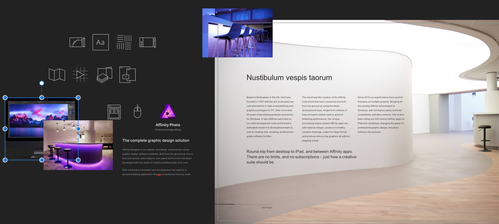
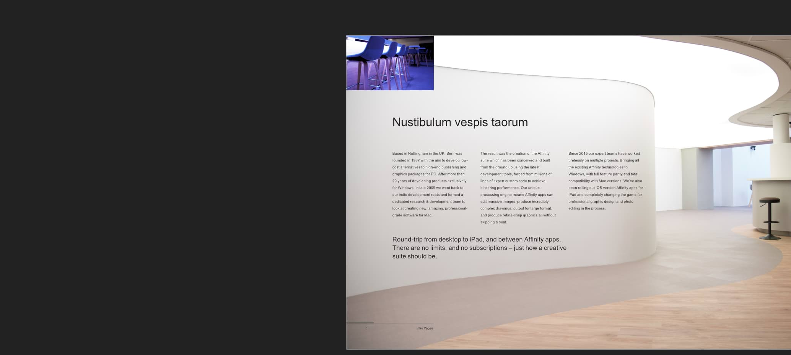

# Clip to Canvas

Clip to Canvas restricts the document view, so you can only see objects which are placed on the page. When disabled (default), your pasteboard is exposed so you can make use of items stored off page.

*Before and after Clip to Canvas view mode applied.*

When Clip to Canvas view mode is active:

- Objects on the page are visible.
- If objects extend beyond the page edge, only the parts of the object which are on the page are visible.
- Objects on the pasteboard are hidden.

When Clip to Canvas view mode is deactivated:

- The pasteboard becomes visible.
- All objects and layers are visible, regardless of the placement on page or pasteboard.

> **Note:**  If a particular layer or object has been hidden using the **Toggle Visibility** button in the [Layers panel](../21-panels/14-layers-panel.md), it will not be visible regardless of whether Clip to Canvas is active or not.

**To deactivate/activate Clip to Canvas:**

- From the **View** menu, select **View Mode** and then select **Clip to Canvas**.

#### SEE ALSO:

- [Viewing](../04-get-started/08-viewing.md)
- [Arrange/manage layers](../08-layers/06-arrange-manage-layers.md)
