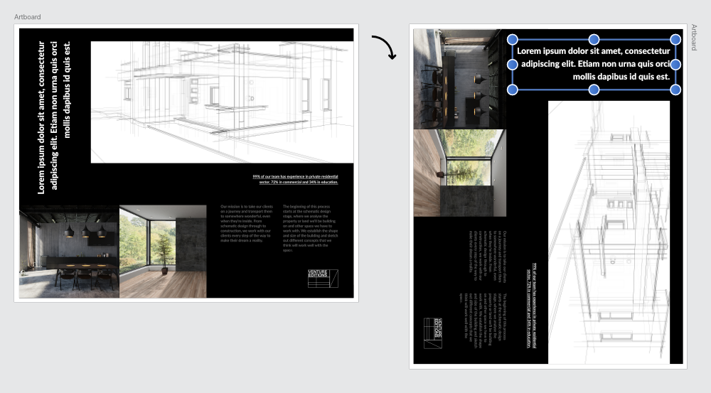

# Rotate document view

Rather than rotating the document permanently, you can rotate the document view instead. This allows you to view your document from a different angle without manipulating its layout.

## About document view rotation

Being able to rotate the document view is beneficial for a number of applications:

- Product design (e.g., product box/packaging layouts with content at 90/180 degree angles)
- Tablet-assisted design (drawing at angles)

**To rotate the document view:**

- On the **View** menu, select **Rotate Left** or **Rotate Right**. The document view will be rotated in 90° increments.

**To reset the document view back to its original rotation:**

Do one of the following:

- On the **View** menu, select **Reset Rotation**.
- **macOS:** Press `Ctrl`+`Shift`+`Cmd`+`R`.
- **Windows:** Press `Cmd`+`Alt`+`Shift`+`R`.

> **Tip:** For greater efficiency, assign your own custom keyboard shortcuts to rotating and resetting document view operations. See [Customizing keyboard shortcuts](../19-workspace/04-customize/01-keyboard-shortcuts.md) for more information.

**macOS:**

**To switch on document view rotation using a scroll wheel:**

- From **Affinity Publisher>Settings** (or **>Preferences**) (Tools option), check **Enable canvas rotation with `Cmd`+scroll wheel**.

**Windows:**

**To switch on document view rotation using a scroll wheel:**

- From **Edit>Settings** (Tools option), check **Enable canvas rotation with `Alt`+scroll wheel**.

> **Note — Modifier keys:** With the above Preference set, the following modifier keys can be used to modify rotation behavior using a mouse scroll wheel:
>
> - **macOS:** Hold down the `Cmd`  while scrolling to rotate around the mouse cursor location.
> - **Windows:** Hold down the `Alt`  while scrolling to rotate around the mouse cursor location.
> - **Windows:** To rotate about the document view center, hold down the `Shift`  and the `Alt`  while scrolling.

#### SEE ALSO:

- **macOS:** [Using a trackpad](../23-extras/04-third-party-support/02-using-a-trackpad.md)
- [Settings (or Preferences)](../25-settings-preferences/01-settings-preferences.md)
- [Keyboard shortcuts for document view](../24-keyboard-shortcuts/01-keyboard-shortcuts.md)
