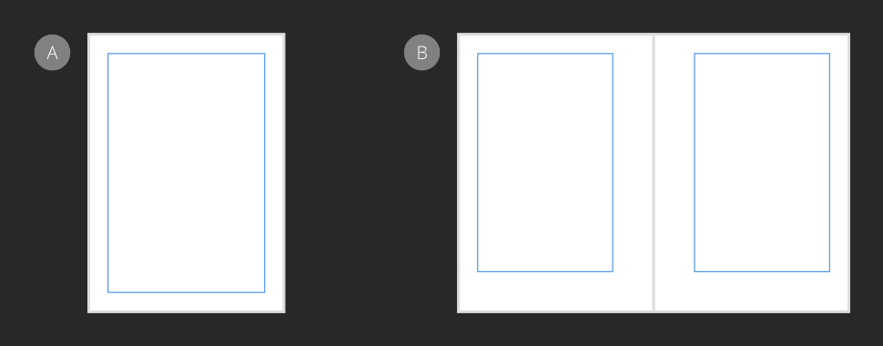

# Margins

The margin is the area between the main content of the page and the page edges (or spread and spread edges). Margins are shown as a blue solid line by default, but this color can be changed. Margins can be set evenly or unevenly depending on the page orientation.

*Uniform margins on single page spread (A) and mirrored margins on facing page spread (B).*

Page margins are set up with each new document when it is created, and can then be edited at a later point via Document Setup. Margins can also be inherited from any assigned master page, replacing the page's current margin settings.

When determining the size of your page margin, it is important to consider how text-intensive the design will be, as well as the page layout and orientation. For printing purposes, you may for example consider allotting additional space to the inside margins of facing pages so text does not disappear in the page gutter.

Design elements positioned outside the margins may not be printed.

Margin positions can be defined manually or by using the settings of an installed printer. They are non-printing and non-exporting.

> **Note:** Margins can also be used for snapping to when creating or moving objects.

> **Tip:** If you intend on exporting your design, rather than printing it directly, you can design with complete freedom from margins. If this is the case, you may wish to switch off the margins.

**To create a new document with margins:**

1. On the **File** menu, select **New**.
2. From the dialog, check **Include margins**.
3. Do one of the following:
  - For *single pages* (**Facing pages** unchecked in Pages section): Set the **Left**, **Right**, **Top**, and **Bottom** margins.
  - For *two-page spreads* (**Facing pages** checked in Pages section): Set the **Inner**, **Outer**, **Top**, and **Bottom** margins.

> **Note:** If you have **Default master** checked, the margin settings will be the property of the master page.

**To change page (master page) margins:**

1. Do one of the following:
  - On the **Pages** panel, `Click`-click a page (master page) thumbnail, and select **Spread Properties**.
  - From the default context toolbar, or **File** menu, select **Document Setup**.
2. Do one of the following:
  - In the pop-up dialog, change margin values in the **Margins** tab.
  - Click **Retrieve Margin from Printer** to automatically set margins to the settings of your desktop printer.

> **Note:** If master pages are applied to pages, the margin settings are taken from the lowest applied master page in the **Layers** panel.

**To hide/show margins:**

- From the **View** menu, deselect/select **Show Margins**. A check mark is displayed next to the menu item when the margins are visible.

**To change the margin color:**

- From the **File** menu, select **Document Setup**.
- From the **Margins** tab, click the color swatch to display a pop-up panel to update the margin color.

#### SEE ALSO:

- [New Document](../04-get-started/01-create-new-documents.md)
- [Snapping](12-snapping.md)
- [Preview mode](11-preview-mode.md)
