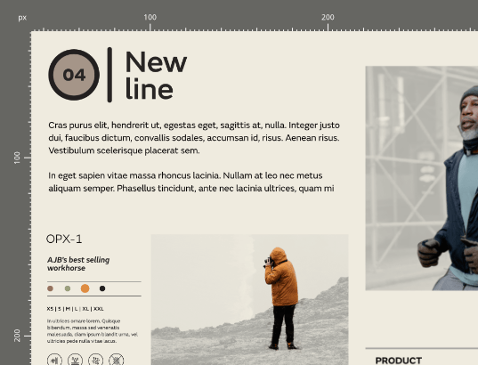

# Rulers

Rulers are useful when you need to accurately place objects or guides in the document view.

> **Note:** The point where 0 appears on each ruler is called the spread origin.

**To show or hide rulers:**

- From the **View** menu, select **Show Rulers**. A check mark is displayed next to the menu item when the rulers are visible.

**To reposition the spread origin:**

- Do one of the following:
  - Drag the spread origin from the horizontal/vertical ruler intersection to position it on the page. If snapping has been activated, the spread origin will be able to snap to objects on the page.
  - From the **View** menu, access **Guides**. Enter **X** and **Y** values into the **Spread Origin** section.

> **Note:** If you have placed ruler guides, their positional values will be recalculated based on the repositioned spread origin.

> **Note:** Changing the units, via `Click`-click of the ruler intersection, will automatically change the units on displayed rulers.

#### SEE ALSO:

- [Guides](06-ruler-and-column-guides.md)
- [Snapping](12-snapping.md)
- [Document units](../04-get-started/07-document-units.md)
