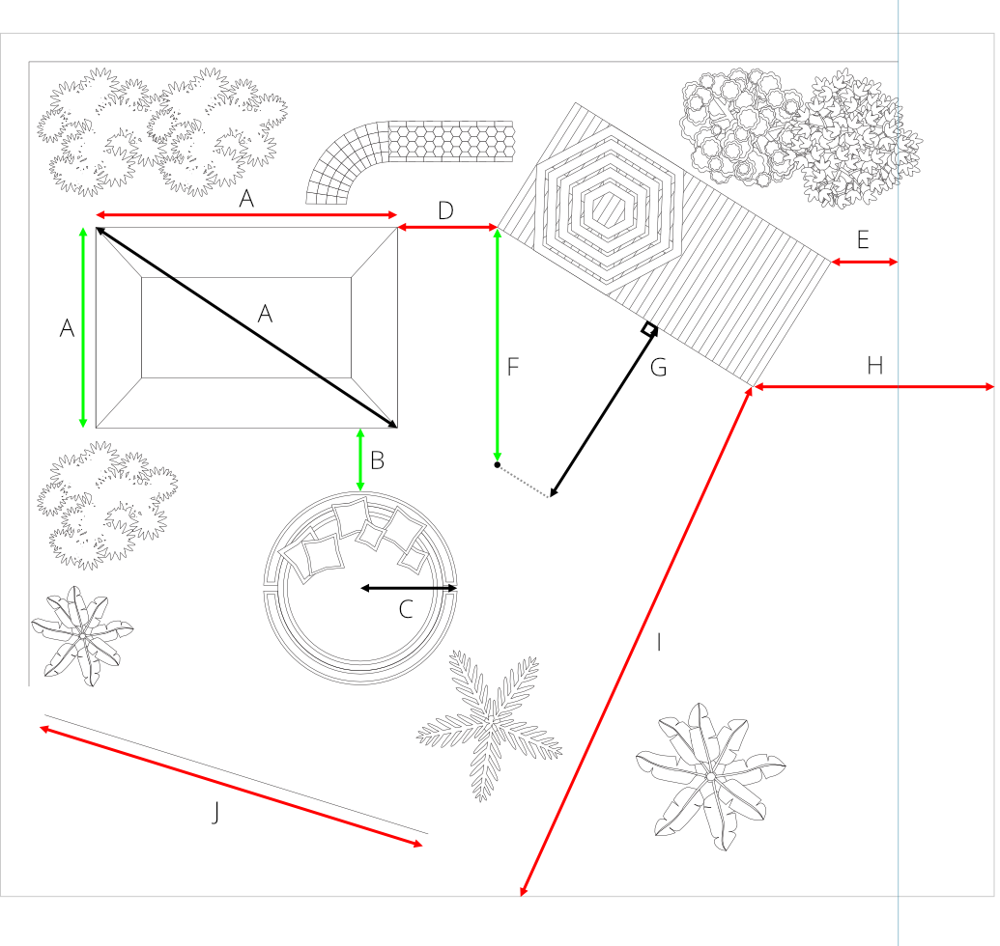
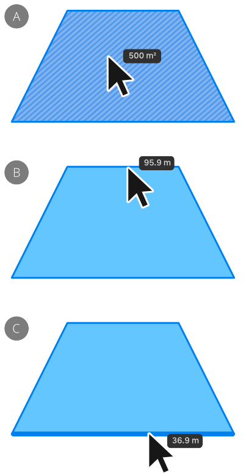
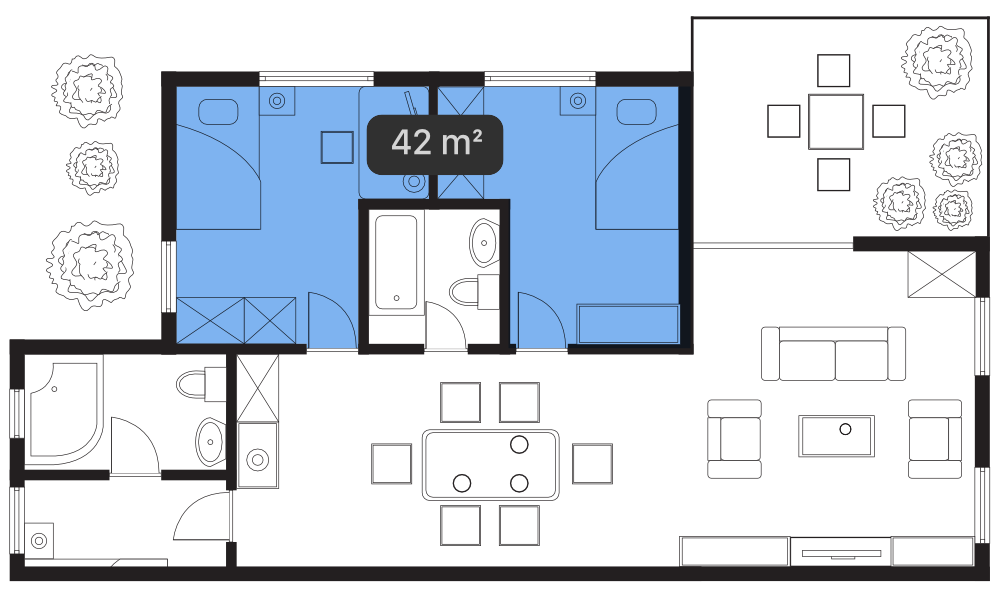
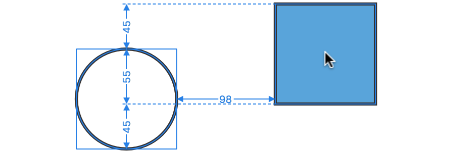
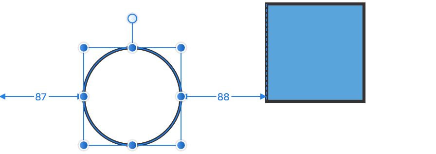

# Measuring

Measuring lets you display the distance between points, objects and page elements on the page—using either a dedicated Measure Tool or a hover over feature. An Area Tool additionally measures the area of one or more objects, plus the perimeter of a shape and open curve lengths.

## Measuring with the Measure Tool

The Measure Tool is hidden by default however it can be added to your set via the top menu's **View**>**Customize Tools** option.

The tool lets you accurately measure the distance between a fixed point and an object's edge, corner, center or at the intersection of two objects vertically, horizontally or diagonally. Curves and page elements such as page center, edge and edges (corners) can also be measured to. The reverse is also true—you can measure from any page element to any point or an object's edge, corner or at object intersection. You can even measure between placed guides.

***Measure Tool**: (A) Point - Point (horizontally, vertically, diagonally), (B) Point - Curve, (C) Point - Center, (D) Point - Line, (E) Point - Guide, (F) Point - Page center, (G) Point - Page center (tangent; with projection line), (H) Point - Page edge and (I) Point - Page edge at Page center and (J) Along a diagonal straight line.*

The Measure Tool is also plane-aware, so measurement can be made along the axes of isometric or axonometric grids.

## Measuring with the Area Tool

This tool displays the area, total perimeter length or specific straight-line segment lengths of an object when you hover over it. For area measurements, linear hatching indicates the targeted object along with the object's area as an overlaid readout.

*Single-object area/perimeter measurement with the **Area Tool**: (A) Area of a closed object, (B) Perimeter of a object, (C) Straight-line 'cusped' segment length on the object.*

You can also calculate the area of multiple objects by clicking an initial object and using modifier keys to include further objects. A blue highlight indicates objects included in the total selection, while dark-blue linear hatching (not shown), on hover over of an object in that selection, identifies it as the 'active' object and reports just its area measurement.

*Multi-object area measurement of selected objects with the **Area Tool**.*

Overlapping objects will report the **Total** area on a hover-over readout; nonoverlapping objects will report it on the context toolbar only.

## Measuring between objects

Using the `Cmd`  with the Move Tool and shape tools will display measurements between objects as you move your cursor around the page. These relate to the distance between the selected object(s) and other object (or page elements) and will update dynamically as the cursor moves.

*'Hover over' measurements displaying the size of the gaps between the selected circle and the square.*

*'Hover over' measurements displayed when a circle is nudged to the right using the right arrow key.*

For example, with a shape selected, measurements will show the distance, using labeled arrows, between the shape and:

- another shape, when the cursor is positioned over that target shape.
- the page edges, when the cursor is positioned over a blank portion of the page.

The measurement will then update as the cursor moves over an object to show the size of the horizontal and vertical gaps between this object and the selection.

> **Note:** Measurements are not persistent, are non-printable and are not saved with your document.

**To display distance measurements:**

1. Select the **Measure Tool**.
2. Do one of the following:
  - Click-drag from a start point to an end point.
  - Click for a start point, then click for an end point.

Use the `Esc`  to clear any measurement.

**To display measurements on hover over:**

- With the **Move Tool** active, select one or more objects and then hold down `Cmd` while moving the cursor over a target object.

The target object will display measurements from the selected object to the target object (if hovered over) or page element (if no objects are hovered over).

> **Note — Modifier keys:** When using the Measure Tool, the following modifier keys can be used while the measurement is being drawn:
>
> - The `Shift`  constrains the measurement line to 45° intervals. Tangents and equal bisecting angles will also be displayed while the key is pressed. Holding the mouse button down for a slightly longer duration will, on dragging, additionally draw a dashed projection line, whose axis can be toggled by pressing the ~ .
> - Use either up or down arrow keys to constrain measurements to vertical; left or right arrow keys to constrain to horizontal.
> - **macOS:** For keyboard's with numeric keypads, numeric keys can change measurement directions as follows:
>   - 0 —reverts back to unconstrained.
>   - 1 —constrain to 45°.
>   - 2 —constrain to vertical.
>   - 3 —constrain to 135°.
>   - 4 —constrain to horizontal.
>   - 5 —constrain to equal angles.
> - The `Alt`  temporarily switches off snapping.
>
> When using the Area Tool, the following modifier keys can be used:
>
> - `Shift`-click adds an object to your current selection for area measurement; use it to deselect an included object too.
> - `Cmd`-click selects a new object and clears the current selection.

#### SEE ALSO:

- [Area Tool](09-measuring/01-tools-area.md)
- [Measure Tool](../20-tools/01-layout-tools/13-measure-tool.md)
- [Snapping](12-snapping.md)
- [Dynamic guides](10-dynamic-guides.md)
- [Customizing Tools](../19-workspace/04-customize/03-tools-panel.md)
