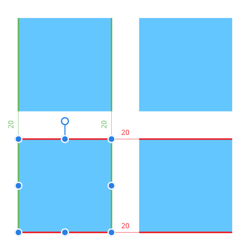
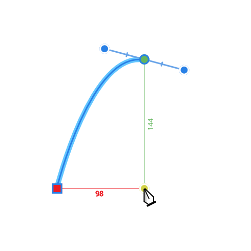

# Dynamic guides

Dynamic guides are intelligent guide lines which automatically appear when moving and aligning objects or nodes.

Dynamic guides appear automatically in two instances:

- As you drag objects to help you align and resize objects to existing object edges, centers, vertices, and page elements (e.g. page margins). These guides display in red when aligning horizontally and in green when aligning vertically.

  
- You'll only see them when **Snapping** is enabled, depending on the active snapping options.
- When drawing curves with the Pen Tool. If **Snap** options on the tool's context toolbar are enabled, nodes or control handles can be snapped to other nodes. To help this, dynamic guides show while dragging nodes or handles. Snapping and guide behavior is completely independent of the 'global' Snapping option on the main toolbar.

  

#### SEE ALSO:

- [Snapping](12-snapping.md)
- [Pen Tool](../20-tools/01-layout-tools/03-pen-tool.md)
- [Measuring guides](09-measuring.md)
- [Guides](06-ruler-and-column-guides.md)
