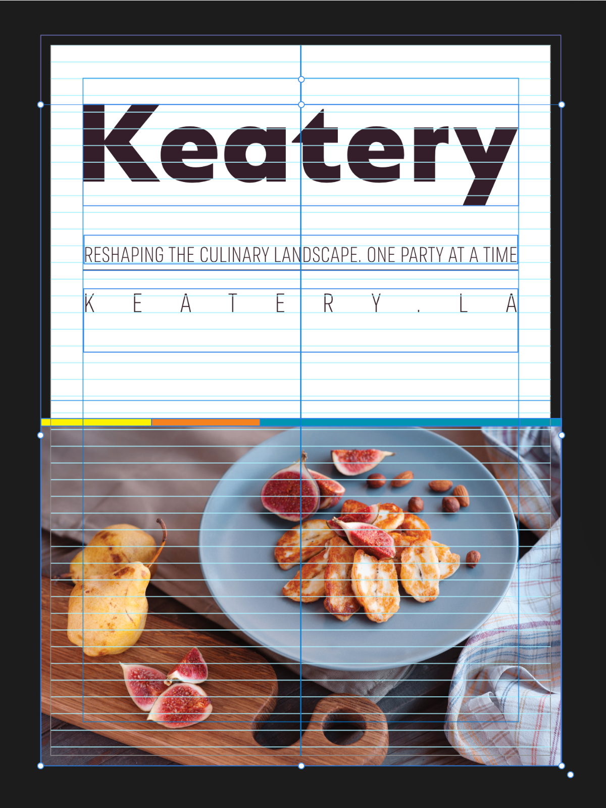

# Preview mode

Preview mode can used to view your publication spread without any distracting on-screen design aids (e.g., grids, baseline grids, ruler/column guides, margins and bleed guides) from being shown. Off-page objects or partially overlapping objects are clipped to canvas. This may help you envisage how your finished project may look.

**To preview your page/spread:**

Do one of the following:

- From the Toolbar, enable **Toggle Preview Mode**; click again to disable.
- From the **View** menu, select **Preview Mode**.

#### SEE ALSO:

- [Grids](04-grids.md)
- [Baseline grids](05-baseline-grids.md)
- [Guides](06-ruler-and-column-guides.md)
- [Margins](07-margins.md)
