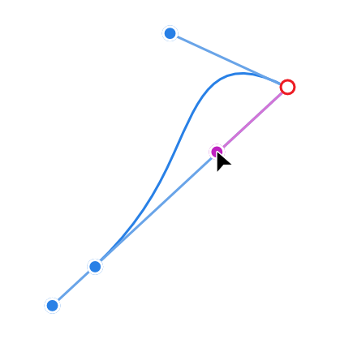
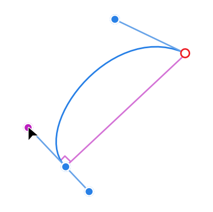
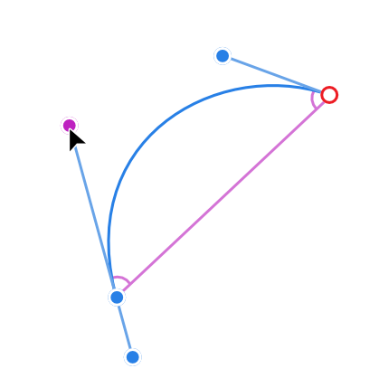
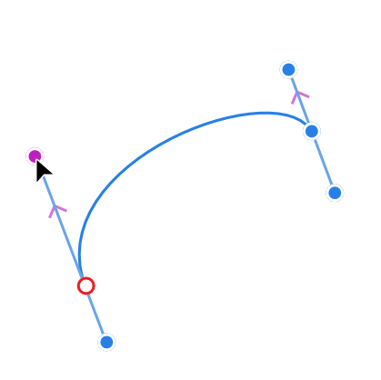
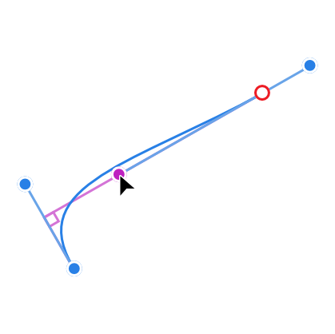
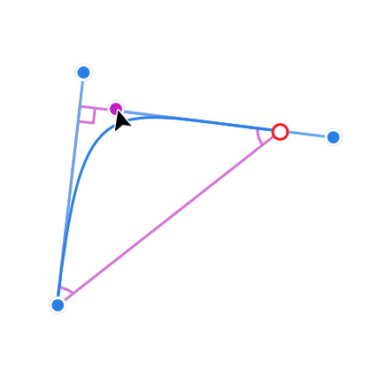
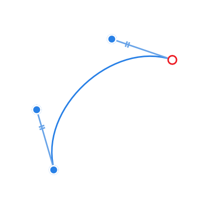

# Construction snapping for curves

Use construction snapping to help you build complicated shapes or intersections accurately and easily, giving you simple access to parallels, right angles, reflected and mirrored angles. Great for precise and symmetrical curve drawing, especially for technical drawing styles and typographic design.

## Construction snapping

Construction snapping lets you snap a node's control handle to useful construction angles relative to the adjacent node and opposing control handle. You can also balance control handle lengths on adjacent nodes.

You can enable construction snapping via a single button which permits control handle snapping to various angles and alignments, i.e.

| Control handle snapping behavior | Example |
| --- | --- |
| Snap the leading control handle inline to adjacent node |  |
| Snap 90° to inline |  |
| Snap to reflected/mirrored angle |  |
| Snap to parallel control handle |  |
| Snap to 90° from parallel control handle |  |
| Snap to logical triangle |  |

These snapping options operate independently of [global snapping](../12-snapping.md). They help avoid having to align control handles to grid or guide and offer additional accuracy and symmetry once nodes have been positioned using [Curve snapping](../13-curve-snapping.md) options.

**To apply construction snapping:**

1. Select the **Pen Tool** or **Node Tool**.
2. From the context toolbar's **Snap** section, enable **Perform construction snapping**.
3. Drag a control handle such that it snaps to angles and alignments.

> **Tip:** For reflected and parallel control handles, after snapping the control handle direction you can use a second action (holding the `Shift` ) to snap the handle lengths to match the preceding or following handle (while maintaining the direction you already snapped to). This produces perfectly balanced control handles, indicated by the double markers.
>
> 
>
> Sometimes you might see both single and double markers on the same control handle which means, respectively, that the control handle pairs are equal length and the control handle is the same length as the adjacent control handle.

#### SEE ALSO:

- [Snapping](../12-snapping.md)
- [Curve snapping](../13-curve-snapping.md)
- [Node Tool](../../20-tools/01-layout-tools/02-node-tool.md)
- [Pen Tool](../../20-tools/01-layout-tools/03-pen-tool.md)
