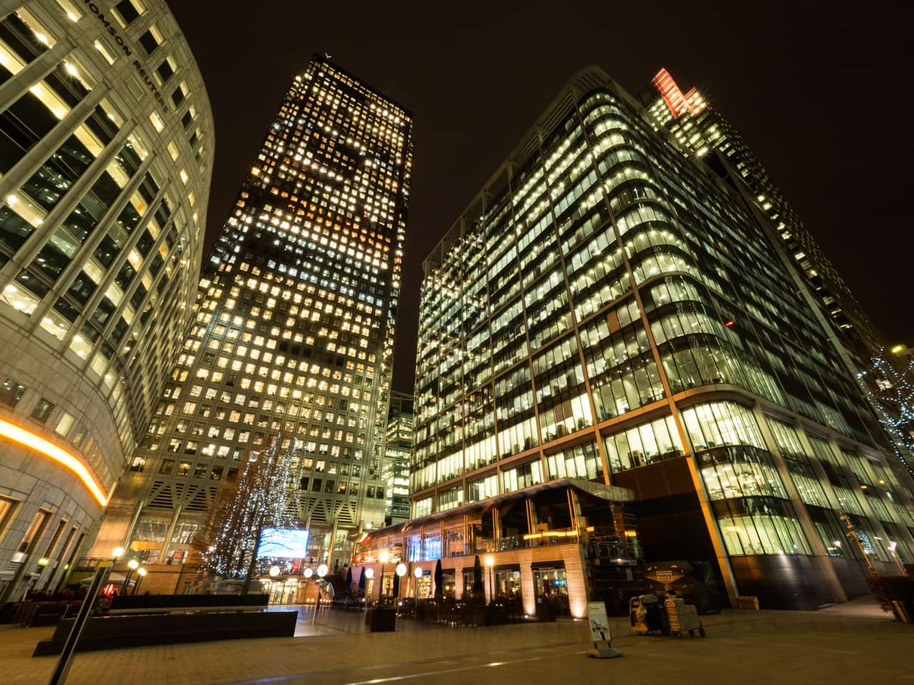
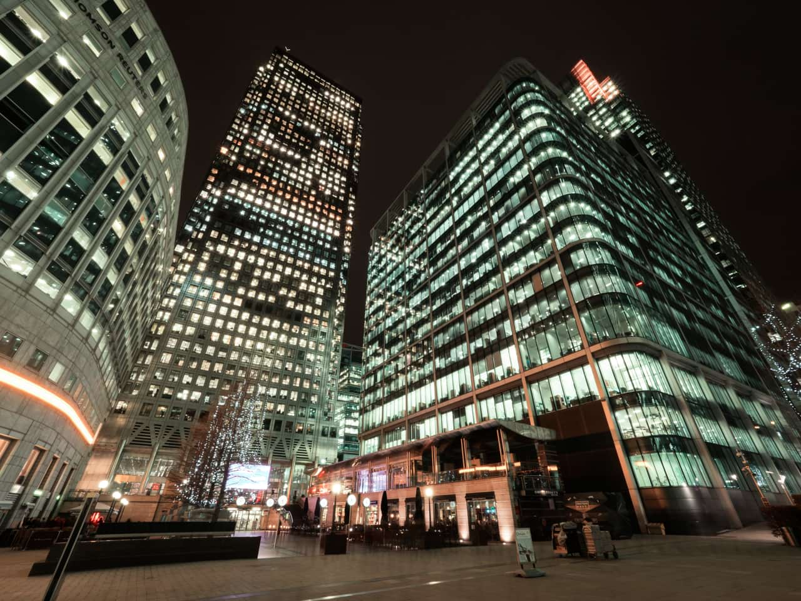

# Channel Mixer adjustment

Adjust the color of individual channels to produce effects not easily achieved with other color adjustment tools.

 Apply this adjustment via the **Adjustment** button on the **Layers** panel or via **Layer** > **New Adjustment**.

> **Tip:** Adjustments can be made in any color mode, regardless of the document's current color mode.

### Settings

The following settings can be adjusted in the dialog:

- **Output Channel**:
  - Select a color mode from the first pop-up menu.
  - Specify a single color channel to apply the adjustment to, including the layer's alpha channel. Select from the second pop-up menu.
- The sliders control the contribution of the named color to the selected output channel. Drag the slider to the left to decrease the level of the named color, drag the slider to the right to increase it.
- **Offset**—controls the overall influence the selected output channel has on the image as a whole. Drag the slider to the left to decrease the output channel's contribution, drag the slider to the right to increase it.

> **Tip:** Modifying the alpha channel produces a keying/matting effect.

#### SEE ALSO:

- [Applying adjustments](01-applying-adjustments.md)
