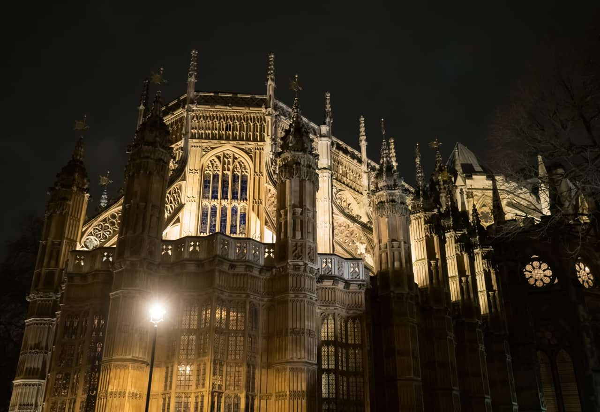
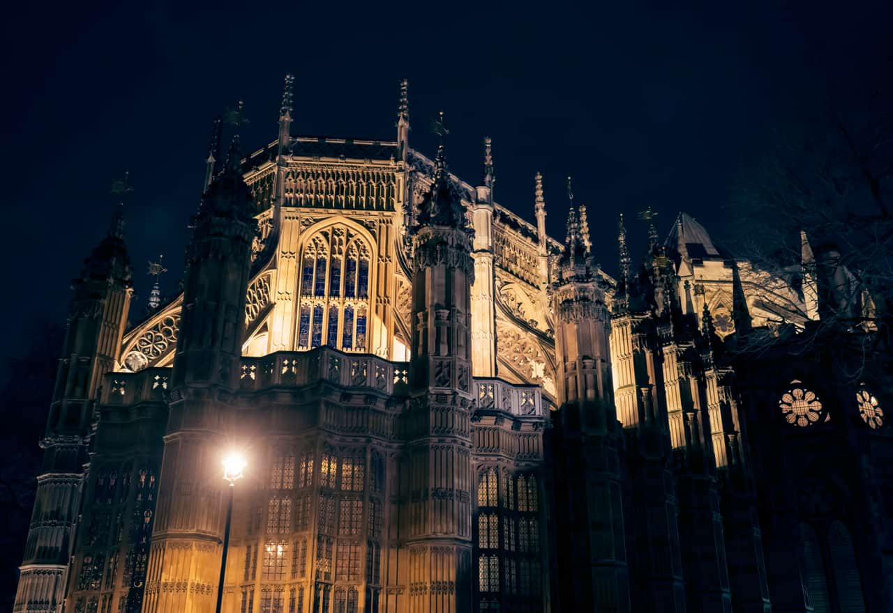

# Color Balance adjustment

The Color Balance adjustment provides a way to modify the contribution of particular colors to a set tonal range.

 Apply this adjustment via the **Adjustment** button on the **Layers** panel or via **Layer** > **New Adjustment**.

### Settings

The following settings can be adjusted:

- **Tonal Range**—determines the tones to be adjusted. Select from the pop-up menu.
- The sliders control the balance of the named colors in the selected **Tonal Range**. Drag the slider toward the color you wish to emphasize.
- **Preserve luminosity**—if this option is off (default), the adjustment ignores the original lightness value of pixels. When selected, the adjustment modifies pixel colors with respect to their original lightness value.

#### SEE ALSO:

- [Applying adjustments](01-applying-adjustments.md)
