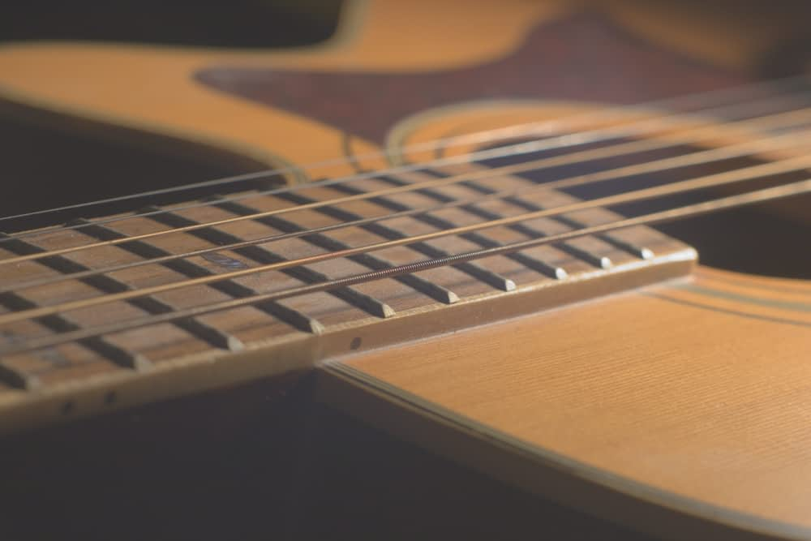
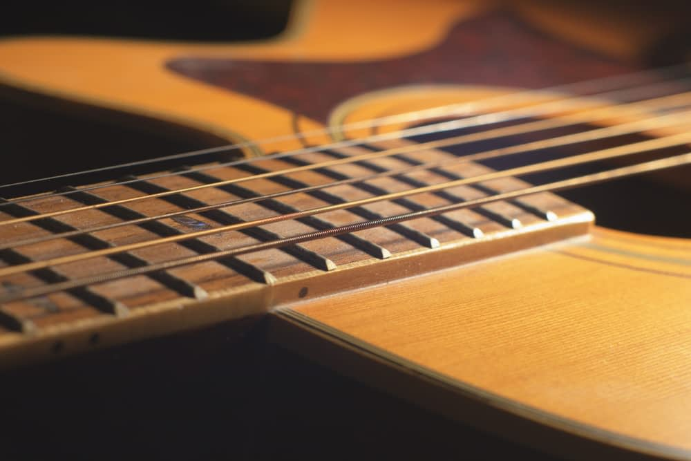

# Curves adjustment

Adjust the color, tone and alpha channels with the curves adjustment, either on individual channels or by adjusting the master curve.

*Before and after adjustment applied.*

 Apply this adjustment via the **Adjustment** button on the **Layers** panel or via **Layer** > **New Adjustment**.

You can use the Curves adjustment to manipulate individual color channels. The adjustment can be used on placed images as well.

> **Tip:** This adjustment can be made in any color mode, regardless of the document's current color mode.

> **Note:** You can also adjust the tonal range of images using the **Levels** and **Brightness and Contrast** adjustments.

### Settings

The following settings can be adjusted in the dialog:

- Select a color mode (**GREY/RGB/CMYK/LAB**) from the first pop-up menu.
- Specify a single color channel to apply the adjustment to, including the layer's alpha channel. **Master** (the default choice) applies the adjustment to all color channels, excluding the alpha channel.
- **Picker**—click to activate the picker which allows you to drag on the image to modify the adjustment. Regardless of the color model set, a click-drag places a node on the curve in relation to the selected pixel intensity; a 1x1 pixel area is considered. Secondly, dragging up (to lighten the image) or dragging down (to darken it) modifies the adjustment. The curve graph will update accordingly.
- **X**—accurately positions any added and currently selected node on the X-axis of the graph.
- **Y**—accurately positions any added and currently selected node on the Y-axis of the graph.
- **Min** and **Max** are the input minimums and input maximums and let you determine the range/threshold of values that are affected by the adjustment. It uses a normalized 0-1 range (regardless of bit depth) but setting **Max** to >1 allows the adjustment to manipulate HDR values as well. They can be also be used to fine-tune the manipulated tonal range in 8-bit and 16-bit documents.

**To adjust a curves graph:**

On the curves graph, do any of the following:

- In the dialog, click **Picker** and then drag up or down on the page.
- Drag the curve to adjust the tonal range of the image.
- Click on the curve to add additional nodes.
- Click to select a node and then press the `Backspace`  to remove it.

> **Tip:** In general:
>
> - Drag the curve downwards to correct overexposure.
> - Drag the curve upwards to correct underexposure.
> - Create a gentle S-shape by adding nodes (see above) and dragging the curve in opposite directions to correct washed out images.

> **Tip:** To fine-tune node positions, try nudging a selected node by pressing the left, right, up, or down arrow key (or alter **X** and **Y** values).

#### SEE ALSO:

- [Applying adjustments](01-applying-adjustments.md)
- [Levels adjustment](12-levels-adjustment.md)
- [Brightness and Contrast adjustment](03-brightness-and-contrast-adjustment.md)
- [Shadows / Highlights adjustment](18-shadows-highlights-adjustment.md)
