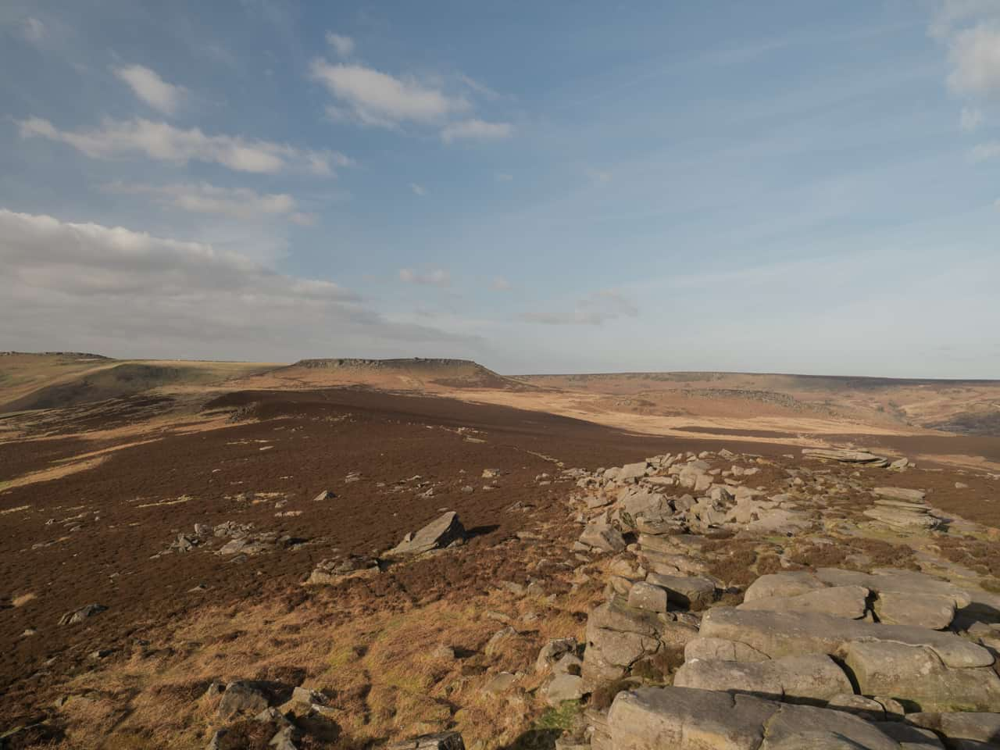
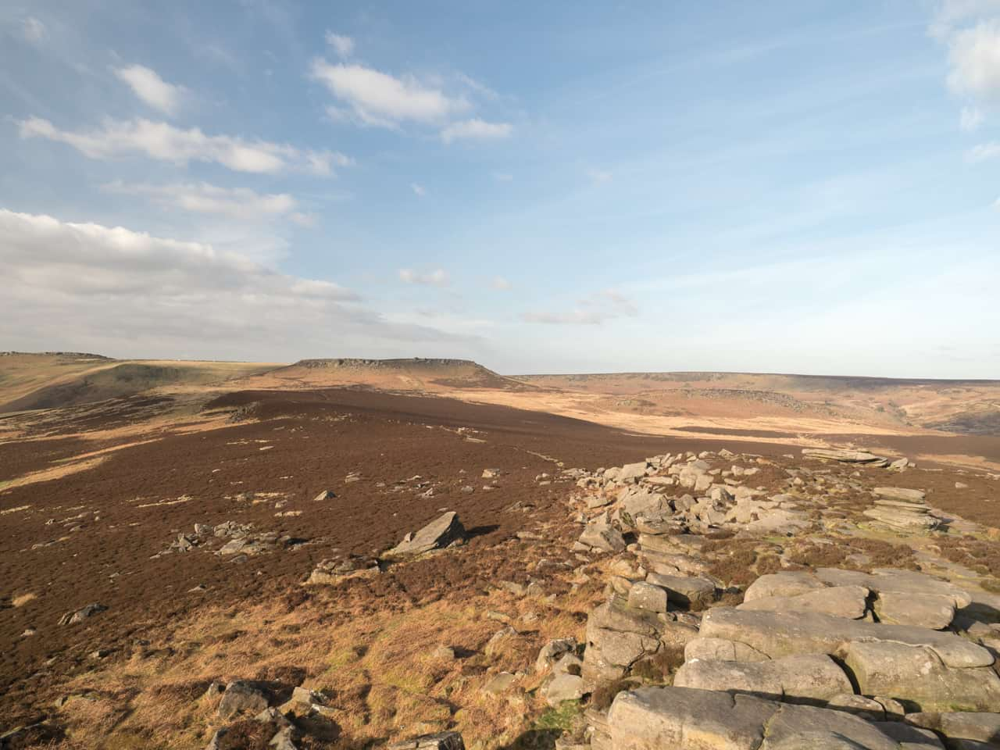

# Exposure adjustment

Alters the overall exposure of the design: good for correcting overexposure/underexposure of images, or for producing a high key or low key look.

 Apply this adjustment via the **Adjustment** button on the **Layers** panel or via **Layer** > **New Adjustment**.

### Settings

The following setting can be adjusted in the dialog:

- **Exposure**—controls the exposure level of the image in stops. Drag to the left to decrease exposure, drag to the right to increase.

> **Tip:** In general:
>
> - Drag the slider to the left to correct overexposure.
> - Drag the slider to the right to correct underexposure.

#### SEE ALSO:

- [Applying adjustments](01-applying-adjustments.md)
- [Curves adjustment](06-curves-adjustment.md)
