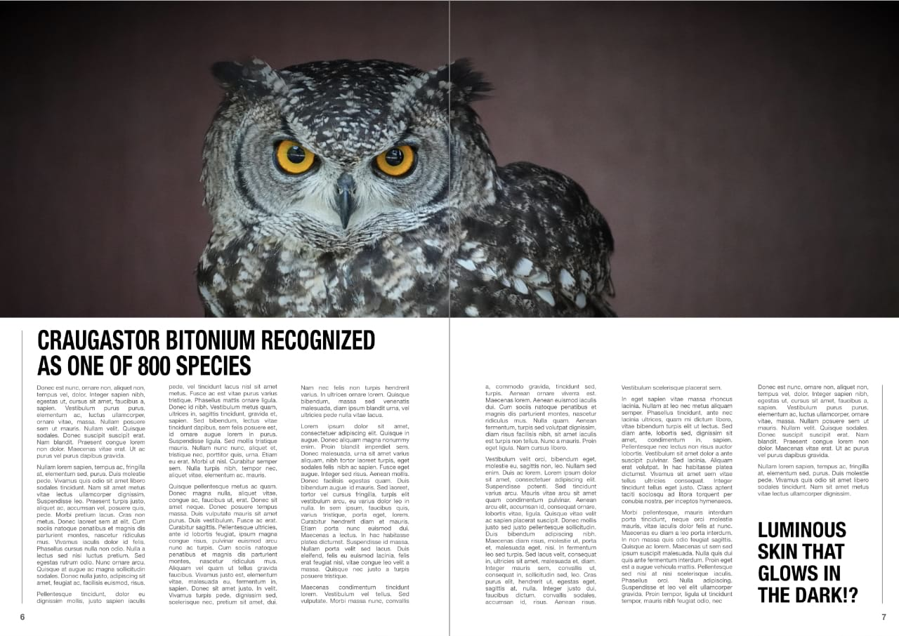
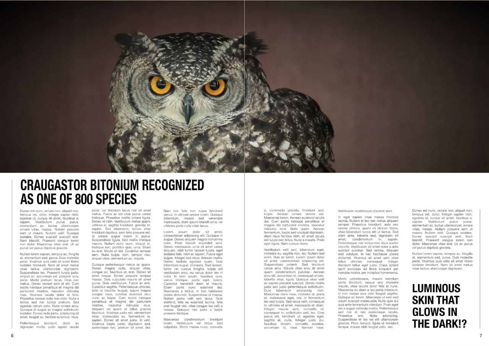

# OpenColorIO adjustment

The **OpenColorIO** adjustment is designed to help with OpenColorIO color-managed workflows by allowing color transforms between source and destination color spaces. See [Using OpenColorIO](../07-color/05-using-opencolorio.md) for more information.

*Before and after OCIO adjustments applied to convert the image to the same color space as the background render.*

 Apply this adjustment via the **Adjustment** button on the **Layers** panel or via **Layer** > **New Adjustment**.

### Settings

The following settings can be adjusted:

- **Source Color Space**—sets the input color space to use for transforming.
- **Destination Color Space**—sets the output color space.

> **Tip:** This adjustment requires a valid OpenColorIO configuration in order to be usable. See [Using OpenColorIO](../07-color/05-using-opencolorio.md) for instructions on setting up a configuration.

#### SEE ALSO:

- [Applying adjustments](01-applying-adjustments.md)
- [Using OpenColorIO](../07-color/05-using-opencolorio.md)
