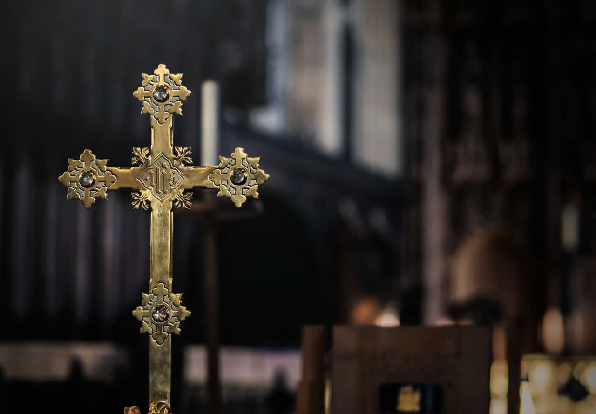
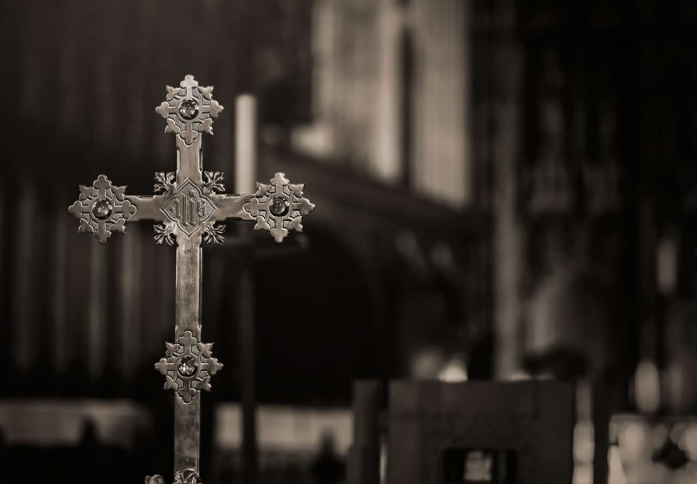

# Recolor adjustment

Create a monochrome image using the full spectrum of colors.

*Before and after adjustment applied.*

 Apply this adjustment via the **Adjustment** button on the **Layers** panel or via **Layer** > **New Adjustment**.

### Settings

The following settings can be adjusted in the dialog:

- **Hue**—controls the color tint applied to the image. Drag the slider to shift the tint through the spectrum.
- **Saturation**—controls the intensity of the image's color. Drag the slider to the left to decrease color intensity, drag to the right to increase it.
- **Lightness**—controls the overall brightness of the image. Drag the slider to the left to decrease brightness, drag to the right to increase brightness.

> **Tip — Creating black and white and sepia images:** - To create a desaturated (black and white) image, position the **Saturation** slider to the far left.
> - To create a sepia image, position the **Hue** slider anywhere around the orange section of the spectrum and position the **Saturation** slider anywhere left of the center.

#### SEE ALSO:

- [Applying adjustments](01-applying-adjustments.md)
- [Black and White adjustment](02-black-and-white-adjustment.md)
- [HSL adjustment](09-hsl-adjustment.md)
