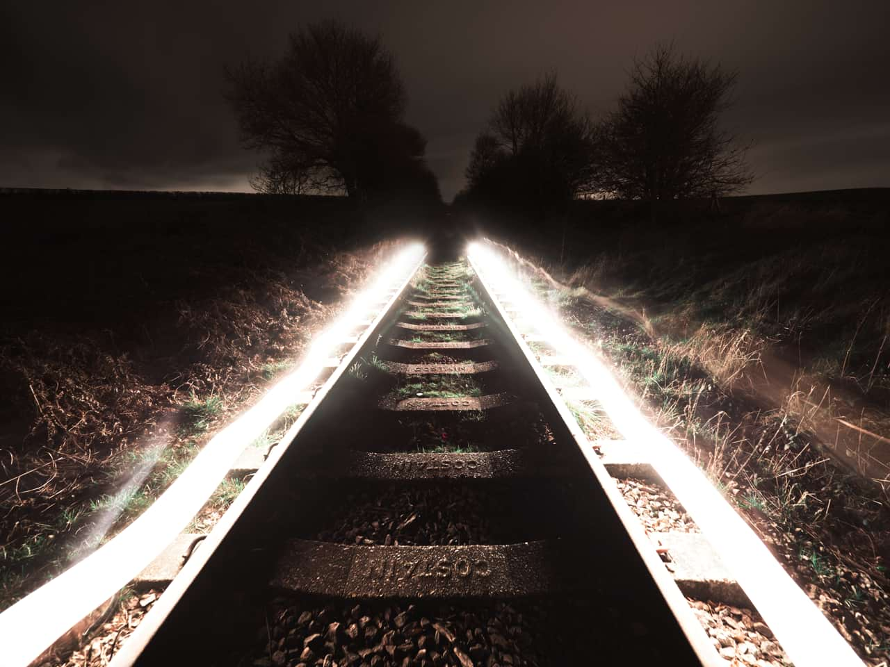
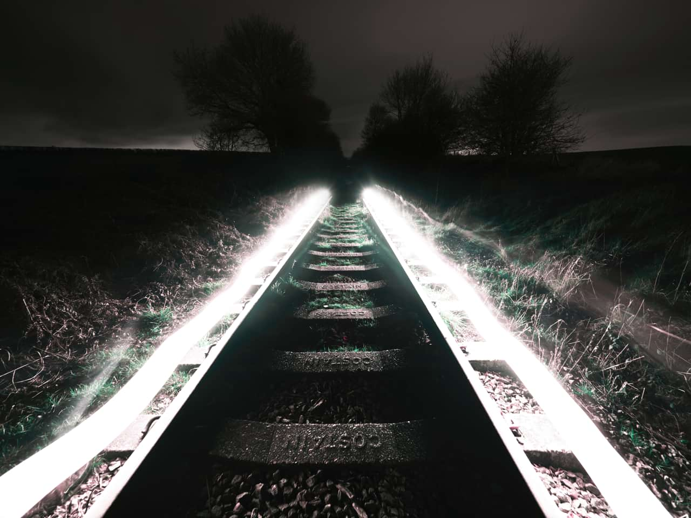

# Selective Color adjustment

The Selective Color adjustment provides a way to subtly adjust and enhance colors in your image on an individual channel basis. It makes a useful tool for color balance corrections.

*Before and after adjustment applied.*

 Apply this adjustment via the **Adjustment** button on the **Layers** panel or via **Layer** > **New Adjustment**.

> **Note:** This adjustment produces subtle effects. Even at the extreme ends of the adjustment, you shouldn't see many artefacts or saturated pixels. If you intend to make extreme adjustments, such as completely recoloring pixels, then the HSL adjustment will be more suitable.

### Settings

The following settings can be adjusted in the dialog:

- **Color**—determines the color to be adjusted. Select from the pop-up menu.
- **Relative**—when selected (default), color is added or subtracted in proportion to the amount of that color present in the source pixels, giving a more natural effect. If this option is off, colors are added or subtracted based on the absolute percentage specified, regardless of the how much of that color is present in the image.
- The sliders control the levels of the named color in the selected **Color**. Drag the slider to the left to decrease the level of the named color, drag the slider to the right to increase it.

#### SEE ALSO:

- [Applying adjustments](01-applying-adjustments.md)
- [HSL adjustment](09-hsl-adjustment.md)
