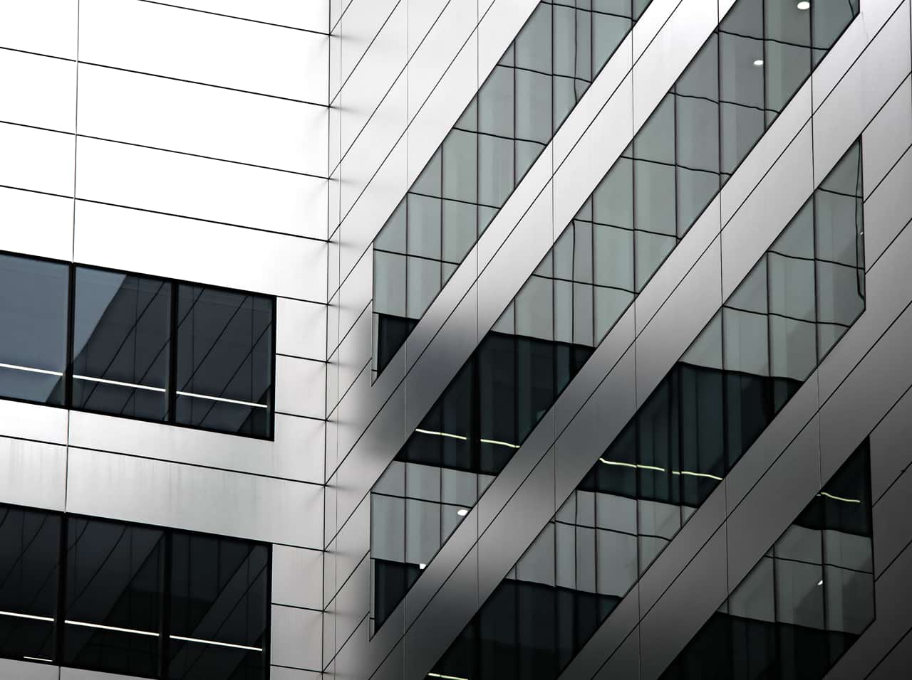

# Shadows / Highlights adjustment

Adjust the lightness of the shadows and highlights in your image.

*Before and after adjustment applied.*

Rather than applying a lighting adjustment to your entire image, making it lighter or darker, this adjustment affects the image's shadow and highlight areas and surrounding pixels.

 Apply this adjustment via the **Adjustment** button on the **Layers** panel or via **Layer** > **New Adjustment**.

### Settings

The following settings can be adjusted in the dialog:

- **Shadows**—controls the lightness of image shadows. Drag the slider to the left to darken shadow areas, drag to the right to lighten them.
- **Highlights**—controls the lightness of image highlights. Drag the slider to the left to darken highlight areas, drag to the right to lighten them.

#### SEE ALSO:

- [Applying adjustments](01-applying-adjustments.md)
- [Brightness and Contrast adjustment](03-brightness-and-contrast-adjustment.md)
- [Levels adjustment](12-levels-adjustment.md)
- [Curves adjustment](06-curves-adjustment.md)
