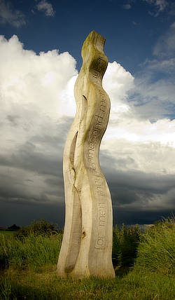

# Split Toning adjustment

Tints and recolors highlights and shadows.

*Before and after adjustment applied.*

 Apply this adjustment via the **Adjustment** button on the **Layers** panel or via **Layer** > **New Adjustment**.

### Settings

The following settings can be adjusted:

- **Highlights Hue**—controls the color tint of highlights.
- **Highlights Saturation**—controls the intensity of the highlight colors. Drag the slider to the left to decrease color intensity, drag to the right to increase it.
- **Shadows Hue**—controls the color tint of shadows.
- **Shadows Saturation**—controls the intensity of shadow colors. Drag the slider to the left to decrease color intensity, drag to the right to increase it.
- **Balance**—controls the emphasis of the adjustment. Drag the slider to the left to emphasize highlight color, drag to the right to emphasize shadow color.

#### SEE ALSO:

- [Applying adjustments](01-applying-adjustments.md)
