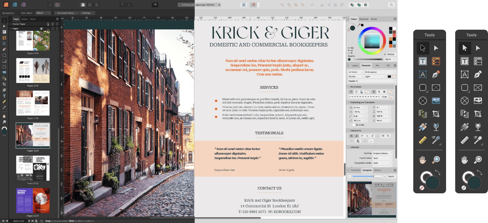

# Changing the UI appearance

Affinity Publisher has a dark User Interface (UI) by default. This makes it easier to accurately view and edit the colors in your designs. However, you can swap the UI interface from dark to light (and vice versa), adjust the background grayscale or the overall Gamma for contrast changes, and switch from colorized to monochromatic iconography in the UI.

*Dark vs light UI styles with colorized (default) vs monochromatic iconography.*

**To change the UI from dark to light (or vice versa):**

1. **macOS:** Choose **Affinity Publisher**>**Settings** (or >**Preferences**).
2. **Windows:** Choose **Edit**>**Settings** (or >**Preferences**).
3. Click the **User Interface** label.
4. For **UI Style**, choose Dark, Light, or Default OS (Mac only).

**To change the UI background or Gamma level:**

1. **macOS:** Choose **Affinity Publisher**>**Settings** (or >**Preferences**).
2. **Windows:** Choose **Edit**>**Settings** (or >**Preferences**).
3. Click the **User Interface** label.
4. Drag the sliders to set the **Background Grey level**, **Artboard Background Grey level** and/or **UI Gamma** level.

**To display monochromatic icons in the UI:**

1. **macOS:** Choose **Affinity Publisher>Settings** (or **>Preferences**).
2. **Windows:** Choose **Edit>Settings**.
3. Click the **User Interface** label.
4. For **Icon Style**, choose Mono.

#### SEE ALSO:

- [About workspace modes](01-application-and-document-windows.md)
- [Customizing the workspace](04-customize/02-workspace.md)
- [Customizing the Toolbar](04-customize/04-toolbar.md)
