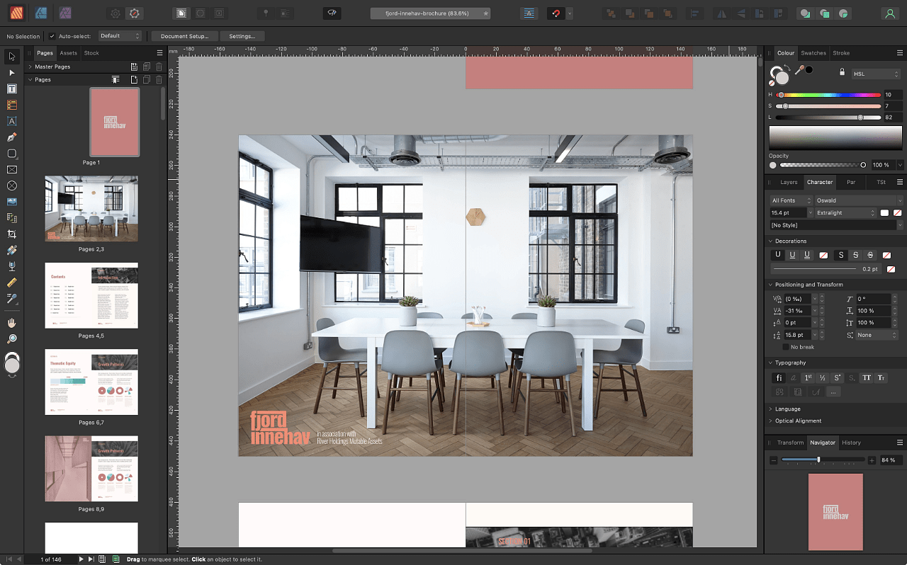
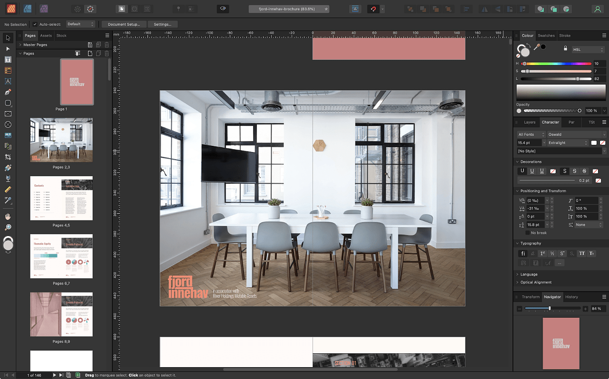
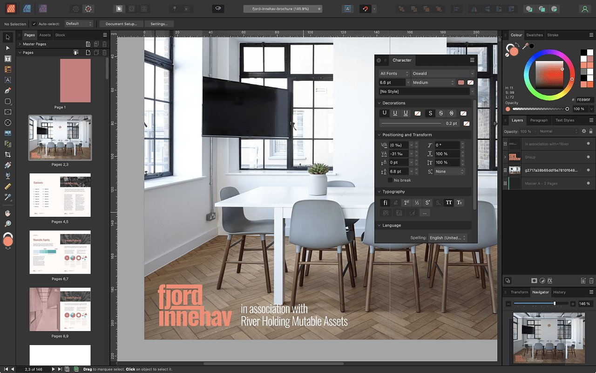
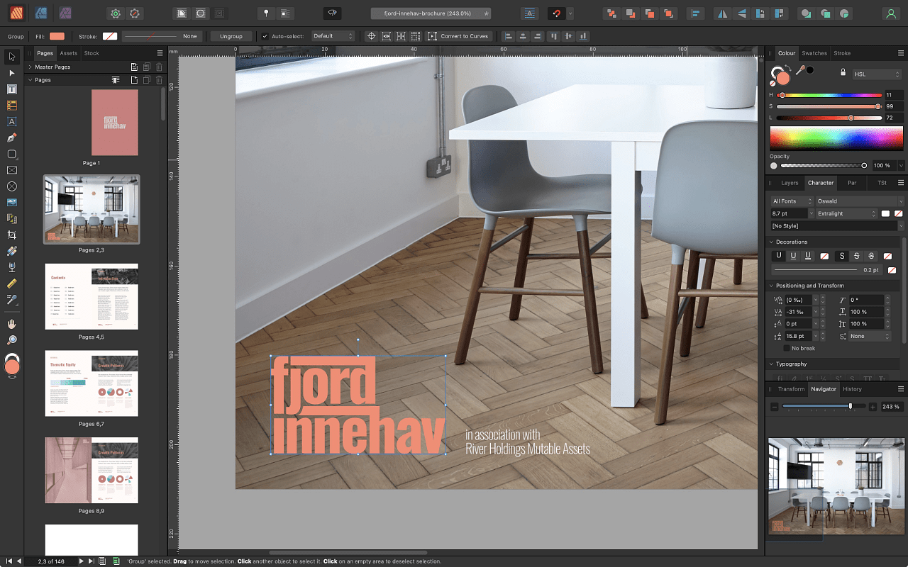

# Accessibility

Certain settings and preferences in Affinity Publisher can be adjusted to help make the workspace more accessible, improving visibility of designs, readability of text, and adjustability of tool handles.

## Customizing the UI appearance

From the app's settings, you can change the UI style, as well as the UI background, artboard background gray level or UI gamma level, adjusting the contrast to improve visibility.

**To change the UI from dark to light (or vice versa):**

1. **macOS:** Choose **Affinity Publisher**>**Settings** (or >**Preferences**).
2. **Windows:** Choose **Edit**>**Settings** (or >**Preferences**).
3. Click the **User Interface** label.
4. For **UI Style**, choose either Dark or Light.

**To change the UI background, Artboard background or Gamma level:**

1. **macOS:** Choose **Affinity Publisher**>**Settings** (or >**Preferences**).
2. **Windows:** Choose **Edit**>**Settings** (or >**Preferences**).
3. Click the **User Interface** label.
4. Drag the sliders to set the **Background Grey level**, **Artboard Background Grey level** and/or **UI Gamma** level.

**macOS:**

Customizing the UI font size The UI font size can be increased via the app's settings to improve readability of text throughout the app.  

To change the UI font size:  Choose **Affinity Publisher**>**Settings** (or >**Preferences**). Click the **User Interface** label. For **UI Font Size**, choose either Default or Large.

## Customizing tool handle sizes

Tool handle sizes can be increased and decreased via the app's settings, making them more visible and easier to select.

**To adjust tool handle sizes:**

1. **macOS:** Choose **Affinity Publisher**>**Settings** (or >**Preferences**).
2. **Windows:** Choose **Edit**>**Settings** (or >**Preferences**).
3. Click the **Tools** label.
4. Select your preferred **Tool Handle Size** setting.

#### SEE ALSO:

- [About workspace modes](01-application-and-document-windows.md)
- [Customizing the workspace](04-customize/02-workspace.md)
- [Customizing the Toolbar](04-customize/04-toolbar.md)
