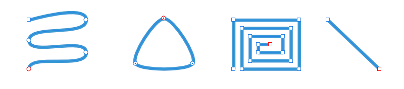
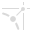
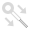

# Pen Tool

The **Pen Tool** is used to precisely draw curves and shapes. The drawn path can be converted to a text frame or text path.

*Pen Mode, Smart Mode, Polygon Mode, Line Mode*

It lets you draw straight lines or curves as a single segment (like a section) or multiple segments. Segments are delimited by 'on-curve' nodes which possess 'off-curve' control handles. These handles can lengthened, shortened and moved to control the shape of the curve.

> **Tip:** Tool shortcut : `P`

It has seven modes which are available to select in the context toolbar. Each mode changes how the line is drawn.

### Pen Mode

The most powerful and precise mode used to create bézier curves and shapes with smooth or sharp corners and nodes.

### Smart Mode

Easily create flowing curves and shapes by clicking and placing nodes.

### Polygon Mode

Used to draw straight lines with sharp nodes and shapes with straight edges.

### Line Mode

Used to draw single-segment straight lines that self terminate.

### Preserve selection when creating new curves

Used in conjunction with any one of the other modes, it keeps the previously drawn curve(s) selected so that their nodes and geometry can be more easily snapped to as you draw.

### Add new curve to selected curves object

Used in conjunction with any one of the other modes, it creates additional curves on the same layer as the initial curve.

### Rubber Band mode

Used in conjunction with any one of the other modes, it previews the next segment to be drawn before placement of the new node. Your cursor position is followed.

### Settings

The following settings can be adjusted from the context toolbar:

- **Fill**—click the color swatch to display a pop-up panel to update fill color.
- **Stroke**—click the color swatch to display a pop-up panel to update stroke color.
- **Stroke properties**—click to access stroke properties such as stroke style, width, cap, join and align, as well as arrowhead styles and manual pressure profiles.
- **Mode**—switches between the available modes (see above).
-    **Convert**—converts the selected node into a **Sharp**, **Smooth**, or **Smart node**.
- **Action**—Manipulates the curve(s):
  -  **Split Curve After Node** adds a new node at the midpoint of one of the curve segments of the currently selected node, depending on the current curve orientation (indicated by a red-line indicator). Use **Reverse Curve** to change this curve orientation.
  -  **Break Curve** opens the shape at the selected node.
  -  **Close Curve** joins the start and end nodes to create an enclosed shape.
  -  **Smooth Curve** modifies a line or shape, by adding and removing nodes, to make it rounder and softer.
  -  **Join Curves** connects two separate curves together to make one curve. Curves need to be both selected with the `Shift`  using either the Node Tool or `Cmd`  as you draw.
  -  **Reverse Curves** reverses the direction the curve was drawn in.
- **Snap**—Controls node snapping: These options are independent of the global [snapping](../../16-design-aids/12-snapping.md) options.
  -  **Align to nodes of selected curves**—will horizontally or vertically align any node you drag to any other node on the same or a different curve.
  -  **Snap to geometry of selected curves**—will snap dragged nodes to the same or different curve's path (or node).
  -  **Snap all selected nodes when dragging**—will snap multiple selected nodes, when dragging, to a "target" node on any selected curves.
  -  **Align handle positions using snapping options**—will snap a control handle using any of the snapping criteria currently set in Global snapping, e.g. to grid, guide, object geometry, key points, spread, margin, etc.
  -  **Perform construction snapping**—allows control handle snapping:
    - inline with adjacent node.
    - to 90° from inline.
    - to reflected angle with adjacent control handle.
    - parallel to adjacent control handle.
    - 90° to parallel control handle.
    - to logical triangle.
- **View**:
  -  **Show Orientation**—displays the segment leading up to the end node in red to help visualize the direction of the closed shape's outline (used for winding fill mode); the drawing direction is away from the red-line indicator.
- **Style**—choose from the following options:
  - **Use line style**—when enabled, the outer line of the shape drawn can be edited using the options in the **Stroke** panel.
  - **Use fill**—when enabled, the concave area of the line is filled with the color you select from the revealed **Fill** color swatch as you draw.

#### SEE ALSO:

- [Node Tool](02-node-tool.md)
- [Draw curves and shapes](../../06-drawing-curves-and-shapes/02-draw-curves-and-shapes.md)
- [Edit curves and shapes](../../06-drawing-curves-and-shapes/03-edit-curves-and-shapes.md)
- [Snapping](../../16-design-aids/12-snapping.md)
- [Grids](../../16-design-aids/04-grids.md)
- [Keyboard shortcuts for tools](../../24-keyboard-shortcuts/01-keyboard-shortcuts.md)
