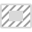

# Picture Frame Rectangle Tool

The **Picture Frame Rectangle Tool** adds a rectangular picture frame to your document into which you can place content.

### Settings

The following settings can be adjusted from the context toolbar:

- **Replace Image**—click to display a pop-up panel from which you can select an updated file to insert inside the picture frame.
-  **Picture Frame Properties**—click to display the advanced property settings for your picture frame.
-  **Show/Hide Fill with Content**—click to remove the background fill on population (useful when framing transparent PNGs).
-  **Size Picture Frame to Content**—If the frame dimensions are different to those of its framed image, click this option to resize the picture frame to make it fit the frame content.
- **Fill**—click the color swatch to display a pop-up panel to update fill color.
- **Stroke**—click the color swatch to display a pop-up panel to update stroke color.
- **Stroke properties**—set the stroke style, width, joins, cap ends, order and arrowhead settings via a pop-up panel.
-  **Presets**—click to display a pop-up panel from which you may select an existing preset (if any are available) or create a new preset.
- **Single radius**—when selected (default), allows you to modify all four corners simultaneously by setting one radius. If this option is off, you can set each corner radius individually to create independent rounded (fillet) corners.
- **Absolute sizes**—by default, the corner radius is specified as a percentage of the object and scales as the object is resized. When selected, this option allows you to specify the corner radius in units. If the object is resized, the corner radius remains the same instead of scaling with the object.
- **Corner**—sets the style and radius of the picture frame's corners. You can choose a Rounded (fillet), Straight (chamfer), Concave (scallop) or Cutout option. You can also alter the radius of your selected corner type by adjusting the percentage slider or manually entering a new percentage.
-  **Enable Transform Origin**—displays a movable transform origin about which the frame can be rotated.
-  **Hide Selection while Dragging**—when selected, the object's selection box is temporarily hidden when transforming the object. If this option is off, the selection box remains visible during transformation. The selected behavior persists across all objects unless it is manually switched.
-  **Show Alignment Handles**—when selected, displays alignment handles at the center and edges of the selected object. Hovering over these handles displays a floating guideline across the page. You can drag the handles to position the center or edges of the selected object in line with this guide.
-  **Transform Objects Separately**—when selected, where multiple objects are selected, they can be be resized, rotated and sheared independently of each other instead of transforming the bounding box.
-  **Convert to Curves**—converts the selected object into a series of connected lines and nodes.
- **Lock Children**—when checked, the image in the picture frame remains unchanged when the frame is transformed. The image's size, position and aspect ratio is maintained.

#### SEE ALSO:

- [Place Tool](06-place-tool.md)
- [Placing content](../../12-placing-external-content/02-placing-content.md)
- [Keyboard shortcuts for tools](../../24-keyboard-shortcuts/01-keyboard-shortcuts.md)
