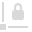

# Transparency Tool

The **Transparency Tool** allows you to apply and edit transparency gradients to vector and text objects.

Gradient transparencies are represented by a path connected by grayscale stops. The grayscale value of the stop represents the opacity/transparency value.

- Black represents fully opaque (100% opacity/0% transparency).
- White represents fully transparent (0% opacity/100% transparency).

> **Note:** The Transparency Tool affects the gradient transparency of an object only—both stroke and fill are affected equally. It has no options for color, as distinct from the [**Gradient Tool**](09-gradient-tool.md).

> **Note:** Solid transparency can be applied from the Color panel or Swatches panel using the **Opacity** slider. To swap from gradient to solid transparency, Select 'None' from the context toolbar's Type pop-up menu, then apply Opacity from either tab to the selected object.

### Settings

The following settings can be adjusted from the context toolbar:

- **Context**—for selected text frames only, the transparency can be applied to the frame **Text** or the **Frame** itself.
- **Type**—converts the object's transparency type to **None**, **Linear**, **Elliptical**, **Radial**, or **Conical**.
- Select, pick, and modify the object's gradient transparency—click the swatch to display a pop-up panel. See the [Gradient and bitmap fills](../../07-color/12-gradient-and-bitmap-fills.md) topic for more information on the settings available.
-  **Rotate gradient**—rotates the applied gradient by 90°.
-  **Reverse gradient**—the end stops swap places. (All intermediate stops are also repositioned accordingly.)
-  **Maintain fill aspect ratio**—if this option is off (default), the end stops can be resized separately which changes aspect ratio. When selected, the end stops are locked to keep the aspect ratio (i.e. changing one will automatically update the other). This setting affects only **Elliptical** and **Bitmap** fills.

#### SEE ALSO:

- [Transparency](../../07-color/13-transparency.md)
- [Gradient Tool](09-gradient-tool.md)
- [Keyboard shortcuts for tools](../../24-keyboard-shortcuts/01-keyboard-shortcuts.md)
