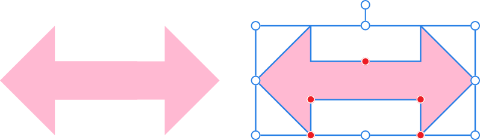
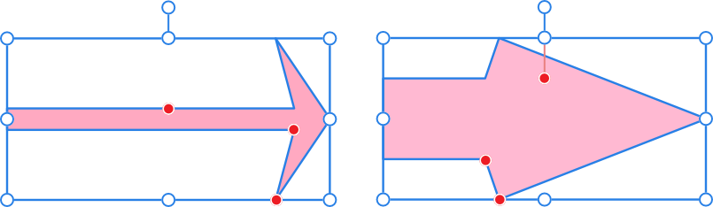
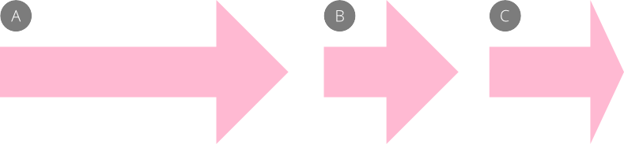
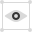
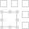

# Arrow Tool

The **Arrow** shape tool makes it easy to quickly add arrows to your design.

*Default shape and handle position (in red) before customization.*

## Customization

The arrow has several options on the shape and on the context toolbar to enable the body thickness and the shape and size of the arrowhead to be controlled.

*Two possible outcomes when the options are customized.*

### Proportional head sizing

When **Proportional** is checked, if the shape is resized horizontally, the arrowhead retains its proportions and the body shrinks or stretches.

*This example shows what happens when you resize an arrow (A) with (B) and without (C) **Proportional** checked.*

### Settings

The following settings can be adjusted from the context toolbar:

- **Fill**—click the color swatch to display a pop-up panel to update fill color.
- **Stroke**—click the color swatch to display a pop-up panel to update stroke color.
- **Stroke properties**—set the stroke style, width, joins, cap ends, order and arrowhead settings via a pop-up panel.
- **Style**—click to display a pop-up panel displaying additional style settings.
- **Thickness**—controls the height of the arrow body.
- **Ends**—sets the 'head' style on either end of the arrow.
- **Proportional**—For Left or Right ends, when checked (default), the head proportions remain fixed when the arrow is resized. If this option is off, the head resizes based on what you have entered for the **Length** and **Inner offset** options.
-  **Enable Transform Origin**—displays a movable transform origin about which the shape can be rotated.
-  **Hide Selection while Dragging**—when selected, the object's selection box is temporarily hidden when transforming the object. If this option is off, the selection box remains visible during transformation. The selected behavior persists across all objects unless it is manually switched.
-  **Show Alignment Handles**—when selected, displays alignment handles at the center and edges of the selected object. Hovering over these handles displays a floating guideline across the page. You can drag the handles to position the center or edges of the selected object in line with this guide.
-  **Transform Objects Separately**—when selected, where multiple objects are selected, they can be be resized, rotated and sheared independently of each other instead of transforming the bounding box.
-  **Convert to Curves**—converts the selected object into a series of connected lines and nodes.
- **Keep selected**—when enabled (default), the new shape layer will be selected on creation. When disabled, the new object is deselected which prevents it from adopting the next object’s stroke/fill properties.

Context toolbar options update depending on the **Ends** style selected (see above). Settings may include the following:

- **Length**—controls the length of the arrowhead/tail.
- A control for the depth and shape of the end style.
- **Size**—controls the horizontal width of the arrow tail. (When Proportional is set, 100% represents a perfect circle, square or diamond.)

> **Note:** To reset any red handle to its default position, simply double-click the handle.

> **Preferences — Settings (or Preferences):** Related behaviors can be adjusted from [the app's settings](../../25-settings-preferences/01-settings-preferences.md):
>
> - **Tools>Tool Handle Size**

#### SEE ALSO:

- [About geometric shapes](../../06-drawing-curves-and-shapes/04-about-geometric-shapes.md)
- [Draw and edit shapes](../../06-drawing-curves-and-shapes/05-draw-and-edit-shapes.md)
