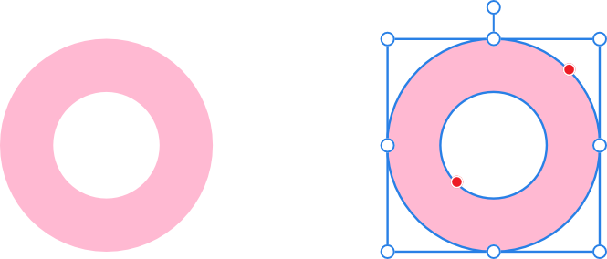
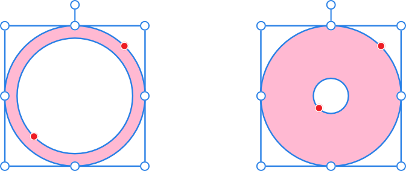

# Donut Tool

The **Donut Tool** easily creates an ellipse shape with a hole cut out of the center.

*Default shape and handle position (in red) before customization.*

## Customization

The Donut Tool has the option on the shape and on the context toolbar to control the size of the hole and completion of the circle.

*Two possible outcomes when the option is customized.*

### Settings

The following settings can be adjusted from the context toolbar:

- **Fill**—click the color swatch to display a pop-up panel to update fill color.
- **Stroke**—click the color swatch to display a pop-up panel to update stroke color.
- **Stroke properties**—set the stroke style, width, joins, cap ends, order and arrowhead settings via a pop-up panel.
-  **Presets**—click to display a pop-up panel from which you may select an existing preset (if any are available) or create a new preset.
- **Hole radius**—controls the width of the hole at the shape's center.
- **Start**/**End angle**—sets the position of the start/end stops relative to 360°. The greater the difference in the angles, the larger the portion of pie.
- **Total angle**—sets the position of the total angle relative to the start angle.
- **Invert angles**—switches the Start and End angle values. This converts acute shapes to obtuse (and vice versa) and flips the shape horizontally and/or vertically.
- **Close Pie**—if the circle is incomplete, closes the shape to create a full circle.
-  **Enable Transform Origin**—displays a movable transform origin about which the shape can be rotated.
-  **Hide Selection while Dragging**—when selected, the object's selection box is temporarily hidden when transforming the object. If this option is off, the selection box remains visible during transformation. The selected behavior persists across all objects unless it is manually switched.
-  **Show Alignment Handles**—when selected, displays alignment handles at the center and edges of the selected object. Hovering over these handles displays a floating guideline across the page. You can drag the handles to position the center or edges of the selected object in line with this guide.
-  **Transform Objects Separately**—when selected, where multiple objects are selected, they can be be resized, rotated and sheared independently of each other instead of transforming the bounding box.
-  **Convert to Curves**—converts the selected object into a series of connected lines and nodes.
- **Keep selected**—when enabled (default), the new shape layer will be selected on creation. When disabled, the new object is deselected which prevents it from adopting the next object’s stroke/fill properties.

> **Note:** To reset any red handle to its default position, simply double-click the handle.

> **Preferences — Settings (or Preferences):** Related behaviors can be adjusted from [the app's settings](../../25-settings-preferences/01-settings-preferences.md):
>
> - **Tools>Tool Handle Size**

#### SEE ALSO:

- [About geometric shapes](../../06-drawing-curves-and-shapes/04-about-geometric-shapes.md)
- [Draw and edit shapes](../../06-drawing-curves-and-shapes/05-draw-and-edit-shapes.md)
- [Ellipse Tool](02-ellipse-tool.md)
