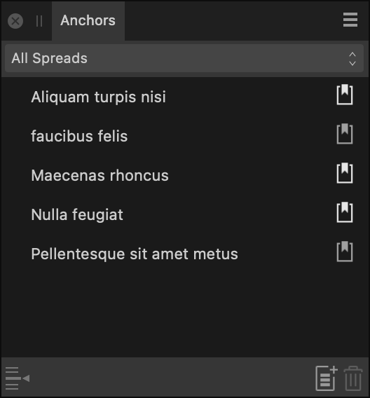

# Anchors panel

The **Anchors** panel allows you to view and edit anchors in your document. Edited anchors will automatically update as they are edited from the panel.

From the **Anchors** panel, you can create a new anchor at a chosen location in your text, display anchors on all or selected pages, and jump to any anchor within your document.

*The Anchors panel.*

> **Note:** This panel is hidden by default. It can be switched on via **Window>References**.

The following sections are visible from the **Anchors** panel:

- **Area**—specify the area you wish to view anchors for from **All spreads** or by selecting one of the pages listed in the menu.
- **Name**—displays the name(s) of the displayed anchor(s).
- **Go to Anchor**—navigates to the selected anchor's location.
- **New Anchor**—when clicked, opens the **Anchor Properties** dialog, allowing you to add a new Anchor.
- **Remove Anchor**—removes the selected anchor.
-  **Export as PDF Bookmark**—when selected, allows the anchor to be exported as a PDF bookmark.

#### SEE ALSO:

- [Hyperlinks](../13-references/05-hyperlinks.md)
- [Hyperlinks panel](12-hyperlinks-panel.md)
- [PDF bookmarks](../13-references/07-pdf-bookmarks.md)
- [Customizing the workspace](../19-workspace/04-customize/02-workspace.md)
