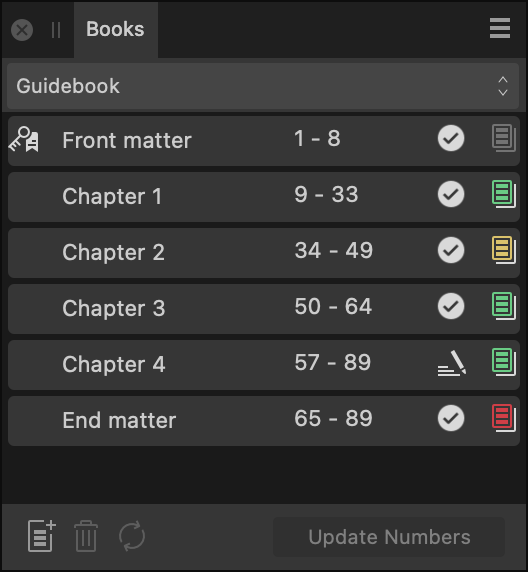

# Books panel

The **Books** panel allows you to manage multiple documents as a cohesive publication.

## About the Books panel

From the **Books** panel, you can:

- Create books and add documents to them as chapters.
- Specify the order of chapters.
- Review and edit the page numbering (pagination) of all chapters.
- Synchronize master pages, text styles, document palettes and table formats from a designated style source chapter to other chapters.
- Open chapter documents for editing.
- Review file and preflight statuses of all chapters.
- Package/print/export selected chapters or the whole book. Exporting to a PDF, say, creates a single file.

> **Note:** This panel is hidden by default. It can be switched on via the **Window** menu.

*The Books panel.*

### About chapter entries

The panel displays the following information, from left to right, for each of a book's chapters:

- Chapter name—the name of the chapter's corresponding document.
- Page range—the page numbers of the chapter's first and last pages.
- Chapter file status—an icon that indicates whether the chapter's file is:
  -  **Open for edit**—the file is currently open for editing.
  -  **Locked**—the file may be open in another app or marked as read-only, for example.
  -  **Not found or accessible**—for example, the file may have been moved or deleted, or is stored in a currently unavailable location.
  -  **Out of date**—its timestamp has changed since it was last opened via the Books panel, e.g. it was opened directly.
  -  **Restricted**—for example, the file is a sample document that cannot be printed or exported.
  -  **OK**—none of the other statuses currently apply to the file.
- Preflight status—an icon that indicates the chapter has passed preflight checks (green), checks have not yet been performed (gray), or that there are warnings (yellow) or errors (red).

 A key icon to the left of one chapter's name indicates it is the **Style Source Chapter** for the purpose of synchronizing styles and master pages between chapters. The Style Source Chapter is your book's first chapter by default, but you can make it any chapter you wish via the Panel Preferences menu.

## Settings

The following items are available on the panel:

- Books—if more than one book is open, select the one you wish to edit from the pop-up menu.
-  **Add Chapter**—opens a dialog in which you can select one or more documents to add to the book.
-  **Remove Chapter**—removes the selected chapter(s) from the book.
-  **Synchronize Chapters**—synchronizes data from the Style Source Chapter to the selected chapters.
- **Update Numbers**—updates **Page Numbers**, **List Numbers**, **Note Numbers** or **All Numbers** for continuity across chapters.

 The following options are available from the Panel Preferences menu:

- **New Book**—creates a new, empty book that is initially unsaved.
- **Open Book**—allows you to browse to an existing .afbook file and open it.
- **Save Book**—saves the selected book, i.e. its chapter list and order, as an .afbook file. (Modified chapters must be saved separately.)
- **Save Book As**—saves the selected book's state to a new file, which becomes the destination for further saves.
- **Close Book**—asks whether to save changes to the selected book, if there are any, and closes the book.
- **Add Chapter**—opens a dialog in which you can select one or more documents to add to the book. (When a document is added, its file is modified. See [Creating Books](../13-references/09-books/02-creating-books.md) for more information.)
- **Open Chapter**—opens the selected chapter(s) for editing.
- **Remove Chapter**—removes the selected chapter(s) from the book.
- **Replace Chapter**—with a chapter selected, allows you to swap its document for a different one.
- **Set Style Source Chapter**—with a chapter selected, sets it as the style source for synchronize operations.
- **Synchronize**—synchronizes data from the Style Source Chapter to the selected chapters.
- **Synchronize Settings**—choose which data will be synchronized from the Style Source Chapter: any or all of **Swatches**, **Text Styles**, **Table Formats**, and **Master Pages**.
- **Save Open Chapters**—saves all open chapters that have unsaved changes.
- **Close Open Chapters**—closes all open chapters. If any have unsaved changes, for each one you will be asked whether to save before closing.
- **Page Number Options**—sets the selected chapter's page numbering to either continue from the previous chapter or start at a specific number
- **Update Numbers**—updates numbering of pages, lists, endnotes (or all three) through your book for continuity across chapters.
  - Scope—for the selected chapters, choose to update **Page Numbers**, **List Numbers**, **Note Numbers** or **All Numbers**.
  - **Update Numbers Before Output**—when checked, page, list and note numbers are automatically updated before exporting or printing. When unchecked, numbers must be manually updated by selecting a Scope option.
  - **Update Page Numbers Automatically**—when checked, Affinity will auto-update a book's pagination as chapters and pages are added to or removed from it, for example. When unchecked, page numbers can be manually updated when needed.
- **Endnotes**—manages endnote bodies whose position is set to **End of Book** in a text frame of your choice.
  - **Insert Endnotes**—inserts relevant endnote bodies from all chapters in order at the text insertion point.
  - **Update Endnotes**—with an insertion point or selection encompassing consolidated endnote bodies, updates the bodies from their respective chapters.
  - **Update Endnotes Before Output**—when checked, endnote bodies will be auto-updated before exporting or printing. When unchecked, endnote bodies can be manually updated when needed.
- **Cross-References**—update cross-references in all chapters of the selected book to display the correct values.
  - **Update Cross-References**—immediately updates cross-references.
  - **Update Cross-References Before Output**—when selected, Affinity will update a book's cross-references when it is printed or exported. When unselected, cross-references are not automatically updated and so may have incorrect values.
- **Stray Pages**—manage how stray pages are handled in facing-pages books. Choose from the following behaviors:
  - **Merge Where Possible**—when checked, where adjacent chapters end and begin with trailing and leading pages, respectively, those pages become a facing-pages spread in the output. When unchecked, the pages are kept separate; they may be single- or facing-page spreads depending on the **Pad** setting.
  - **Pad**—when checked (and if **Merge Where Possible** does not apply), blank pages may be added to the output, opposite chapters' leading and trailing pages that aren't at the book's start or end, to maintain facing-page spreads throughout. When unchecked (and Merge Where Possible does not apply), single-page spreads are allowed in the output.
- **Preflight**—runs preflight checks on the selected chapters' documents or, if none are selected, all chapter documents, and updates Preflight Status icons accordingly.
- **Export**—displays the **Export** dialog to output the current book or the selected chapters, e.g. as a PDF.
- **Print**—displays the **Print** dialog to output the current book or the selected chapters as a hard copy.
- **macOS:** **Reveal in Finder**—with a chapter selected, opens a Finder window with the corresponding file selected.
- **Windows:** **Show in Explorer**—with a chapter selected, opens an Explorer window with the corresponding file selected.

#### SEE ALSO:

- [About books](../13-references/09-books/01-about-books.md)
- [About pages](../05-pages-spreads-and-sections/01-about-pages-and-spreads.md)
- [About master pages](../05-pages-spreads-and-sections/12-master-pages/01-about-master-pages.md)
- [Customizing the workspace](../19-workspace/04-customize/02-workspace.md)
