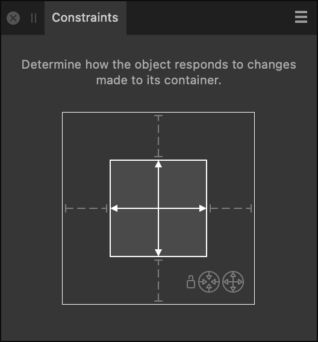

# Constraints panel

The **Constraints** panel lets you control how a child object is positioned and scaled when its parent container is resized.

## About the Constraints panel

> **Note:** The Constraints panel is hidden by default. It can be switched on via the **Window** menu.

*The Constraints panel with left, right and bottom anchoring applied; horizontal scaling is activated.*

The outer box represents the container (parent object). The inner box represents the nested content (child object).

### Options

The following options are available in the panel:

- Anchor lines—when gray and broken (default), the child object is not anchored in the selected direction. When white and solid, the child object is anchored in the selected direction.
- Scaling arrows—when white and solid (default), the child object will scale in the selected direction. When gray and broken, the child object will not scale in the selected direction. If white and broken, the child object is forced to scale in the selected direction due to anchoring applied on opposite sides.
- Lock—when highlighted, this indicator shows that the object has its aspect ratio locked, as a result of Min Fit or Max Fit (below) being enabled.
-  Min Fit—when the parent object is resized disproportionately, the child object may scale so it always fits within its parent object (if unanchored).
-  Max Fit—when the parent object is resized disproportionately, the child object may scale but it will be allowed to be bigger than its scaled parent object, potentially clipping content from view.

#### SEE ALSO:

- [Constraints](../16-design-aids/14-constraints.md)
- [Customizing the workspace](../19-workspace/04-customize/02-workspace.md)
