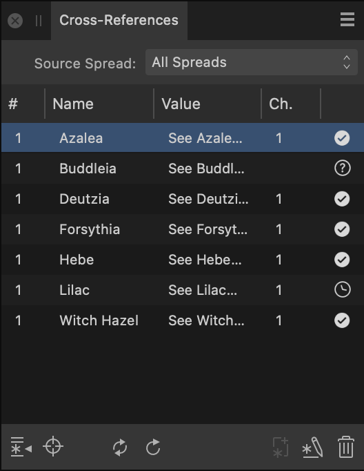

# Cross-References panel

The **Cross-References** panel allows you to insert and manage cross-references to anchors, paragraphs and index marks in your publication.

In your document text, a cross-reference is a field that displays information about the cross-reference's target, such as its page number, section name, or position relative to the cross-reference (i.e. above or below).

The panel lists all cross-references in the current document. The list can be filtered to show cross-references on a specific spread or master page.

## About the Cross-References panel

> **Note:** The panel is hidden by default. It can be switched on via the **Window** menu.

*The Cross-References panel.*

### Settings

The following settings are available on the panel:

- **Source Spread**—selects the scope of cross-references listed on the panel. Choose from *All Spreads*, *Current Spread*, or a specific spread or master page.
- Cross-references list—the page number, name and value (that appears in document text) of cross-references in the selected scope (Source Spread). Click a cross-reference to select it, or -click to select multiple cross-references.
-  **Go to Cross-Reference**—focuses the document view on the selected cross-reference's field.
-  **Go to Target**—focuses the document view on the selected cross-reference's target.
-  **Update Cross-Reference**—updates the value of the selected cross-references on the panel and in their fields.
-  **Update All Cross-References**—updates the values of all cross-references in the current document.
-  **Insert Cross-Reference**—inserts a new cross-reference field at the insertion point in document text and displays a dialog on which you can configure the cross-reference's settings.
-  **Edit Cross-Reference**—displays a dialog on which you can amend the selected cross-reference's settings.
-  **Remove Cross-References**—removes the cross-reference from the panel and converts its field to regular text.

#### SEE ALSO:

- [About cross-references](../13-references/08-cross-references/01-about-cross-references.md)
- [Customizing the workspace](../19-workspace/04-customize/02-workspace.md)
