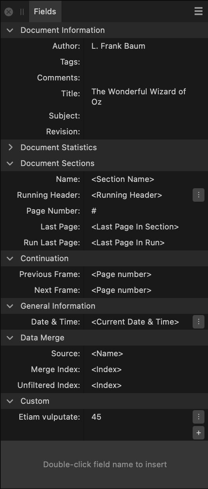

# Fields panel

The **Fields** panel allows you to insert, view and format various pieces of information or metadata within your document to be automatically inserted into the document text. Fields will automatically update as data (for example, a date) changes.

From the **Fields** panel, you can view key information about your document and change the way certain fields are formatted.

*The Fields panel.*

Fields can be inserted at a text insertion point by double-clicking a field name in the panel.

> **Note:** This panel is hidden by default. It can be switched on via **Window>References**.

The following sections are visible from the **Fields** panel:

- **Document Information**—displays the **Author**, **Tags**, **Comments**, **Title**, **Subject**, and **Revision**.
- **Document Statistics**—displays key statistics for the document: **Last edited by**, **Created**, **Saved**, **Printed**, **Save Count**, **Filename**, **Path**, and **Total Pages**.
- **Document Sections**—displays the following for each section of the document: **Name**, **Running Header**, **Page Number**, **Last Page**, **Run Last Page**.
- **Continuation**—displays the **Previous Frame** and **Next Frame**.
- **General Information**—displays the current **Date & Time**.
- **Data Merge**—displays fields that describe the external data source and record that is merged.
- **Data Merge (*data source file name*)**—dynamically displays fields from a currently connected external data source.
- **Custom**—allows you to create your own text fields.

#### SEE ALSO:

- [Fields](../13-references/04-fields.md)
- [Adding sections](../05-pages-spreads-and-sections/09-adding-sections.md)
- [Data merge](../13-references/11-data-merge.md)
- [Customizing the workspace](../19-workspace/04-customize/02-workspace.md)
