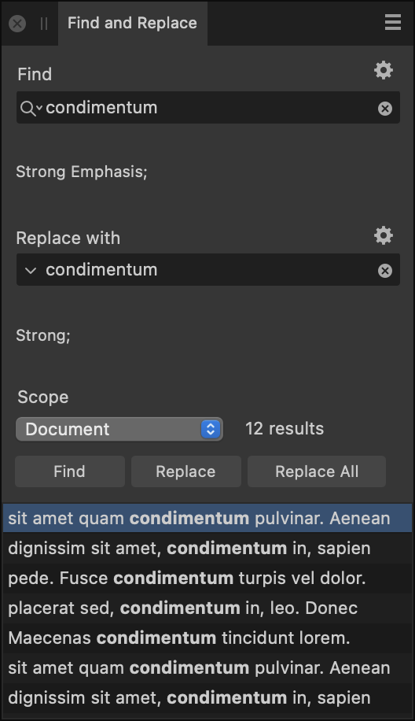

# Find and Replace panel

The **Find and Replace** panel provides an easy way to search for and replace items such as words, fonts, formats, and character attributes either globally, or on a case-by-case basis.

On the **Find and Replace** panel, you can specify items to search for and optionally include a replacement.

*The Find and Replace panel.*

> **Note:** This panel is hidden by default. It can be switched on via the **Window** menu.

The following settings are available on the **Find and Replace** panel:

- **Find**—Specify the item you would like to search for.
  - Select the magnifying glass icon to choose special characters to include in the search. The most recently used search terms are also listed here, and can be cleared by selecting **Clear Recent Finds**.
  -  Select the cross to instantly clear the text from the box.
- **Replace with**—Specify the intended replacement (if any) for the item you are searching for.
  - Select the downward-pointing arrow to select special characters to include in the replacement term. The most recently used replacement terms are also listed here, and can be cleared by selecting **Clear Recent Replaces**.
  -  Select the cross to instantly clear the text from the box.
-  You can further refine your search or replacement behavior by selecting **Formatting** and then selecting additional options from any of the following:
  - **Format**—Select to display a dialog on which to specify the formatting you wish to find in the selected scope.
  - **Character Style**—Select the character style you wish to find in the selected scope.
  - **Paragraph Style**—Select the paragraph style you wish to find in the selected scope.
  - **Reset Format**—Select to clear any formatting settings you have selected.
  - **Match Case**—Select to only display search results matching the case of what you've specified in the **Find** box.
  - **Match Whole Word Only**—Select this option to exclude results that do not match the whole word from the search.
- **Scope**—Select how extensively Affinity will search for the specified item: *Document*, *Section*, *Spread*, *Page*, *Story* or *Selection*. A selection can be a text range or one or more text objects.

#### SEE ALSO:

- [Find and replace](../10-text/11-checking-text/02-find-and-replace.md)
- [Customizing the workspace](../19-workspace/04-customize/02-workspace.md)
