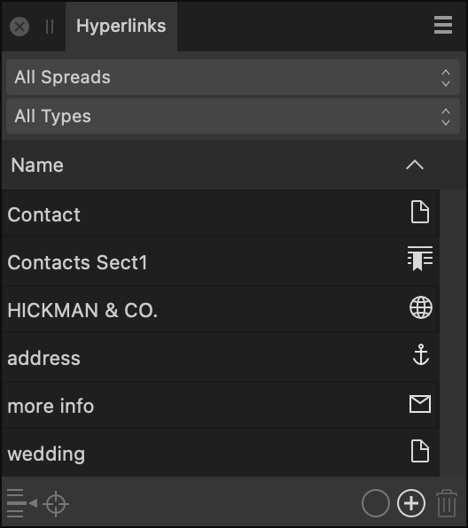

# Hyperlinks panel

The **Hyperlinks** panel allows you to view and edit hyperlinks and their properties from your document. Edited hyperlinks will automatically update as they are edited from the panel.

From the **Hyperlinks** panel, you can opt to view, edit, add and delete hyperlinks from across the whole document or selected pages or spreads.

Exports using a PDF Preset with compatibility set to PDF1.x will automatically be exported with hyperlinks included.

*The Hyperlinks panel.*

> **Note:** Any TOC or index that is generated will automatically create hyperlinks to page references.

> **Note:** This panel is hidden by default. It can be switched on via **Window>References**.

The following options are visible from the **Hyperlinks** panel:

- **Area**—specify the area you wish to view hyperlinks for from **All Spreads** or by selecting one of the pages listed in the menu.
- **Type**—specify the type of hyperlink you wish to view from **All types** or by selecting one of the following hyperlink types:
  -  **Anchor**
  -  **Email**
  -  **File**
  -  **Page**
  -  **Section**
  -  **URL**
- **Name**—displays the name(s) of the displayed hyperlink(s). This list can be sorted using the up and down arrows.
-  **Go to Source**—when clicked, navigates to the hyperlink's source location.
-  **Go to Target**—when clicked, navigates to the hyperlink's target location.
-  **Edit Hyperlink**—when clicked, shows a dialog on which you can amend the properties of the selected hyperlink.
-  **Add Hyperlink**—when clicked, creates a new hyperlink by specifying a name, type, target (destination) and character style for the hyperlinked text.
-  **Remove Hyperlink**—removes the selected hyperlink.

#### SEE ALSO:

- [Hyperlinks](../13-references/05-hyperlinks.md)
- [Customizing the workspace](../19-workspace/04-customize/02-workspace.md)
