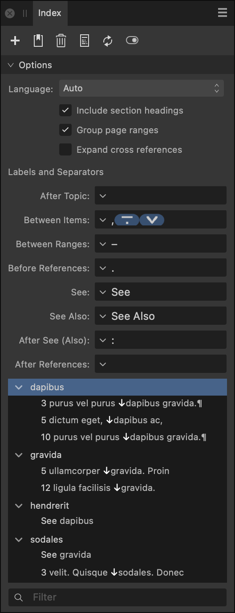

# Index panel

The **Index** panel allows you to generate and structure an index for your document.

## About the Index panel

From the **Index** panel, you can create an index, topics and insert index marks directly onto your page, as well as generate and insert your index in your document.

Index topics are simply index terms that you can search for in your document. From the search results in the panel, you can index all matching terms or index individual terms selectively.

The panel also lets you manage all aspects of index management from a single location.

> **Note:** This panel is hidden by default. It can be switched on via **Window>References**.

*The Index panel.*

The following icons are available at the top of the panel:

-  **Panel Preferences**—displays just topics or topics and their references.
-  **Add Topic**—adds a new index topic to the panel which can be searched for via right click. Enter a name and specify a parent topic by either typing and selecting from the autocomplete box or by expanding the pop-up menu. **Sort By** allows you to specify an alternative label to sort the topic differently to the displayed name (Topic Name). **See** allows you to create a cross reference.
-  **Insert Marker**—inserts an index mark to your page for the currently searched for text. The index mark is placed at the start of the indexed word. When you insert an index mark, the **Topic** name will be pre-filled with the word at the insertion point. Existing topics that may be similar to the word at the insertion point will also be suggested. Typing in the **Topic** box allows you to search existing topics. You can then select a topic from the suggestion list using either the cursor keys or the mouse. Selecting a sub topic will populate both the topic and the parent. If you are creating a new topic, you may specify either a new or existing **Parent Topic**. **Style Override** allows you to specify a character style to use for the page number when this index mark appears in the index.
-  **Delete**—deletes the selected topic/mark from the panel and on the page.
-  **Insert Index**—inserts a generated index in a text frame at the caret position.
-  **Update Index**—updates an existing generated index to include newly added index topics/marks.
-  **Show/Hide Index Marks in the document**—displays or hides index marks inserted into the text on your document pages.

When you insert an index mark, the topic name will be pre-filled with the word at the insertion point. Existing topics that may be similar to the word at the insertion point will also be suggested. Typing in the box allows you to search existing topics. You can select a topic from the suggestion list using either the cursor keys or the mouse. Selecting a sub topic will populate both the topic and the parent. If you are creating a new topic, you may specify either a new or existing parent topic. Style override allows you to specify a character style to use for the page number when this index mark appears in the index.

When you insert an index into the document, a number of styles will be generated. The section headings, each level of index, the page numbers and the cross reference label each get their own text styles which can be modified with the usual tools.

Changes that you make using the index panel are updated in the document straight away but editing the text of the document may cause the page numbers in the index to get out of date and this isn't updated automatically. To update this, hit the update button. If updates are needed before printing and exporting, Publisher will display a warning.

In the text menu there are options to insert an index mark, insert the index, update the index and show/hide index marks.

### Options

There are a number of options that affect how the generated index looks. Any alterations made to the following options will be reflected immediately in the document:

- **Language**—by default, the index is sorted in accordance with the language of the paragraph where it is inserted, but you can choose to override this by selecting an index language from the pop-up menu.
- **Include section headings**—when checked, the index topics will be divided up into sections based on their initial letter. The initial letter will be placed at the start of each section.
- **Group page ranges**—when checked, ranges of three or more consecutive page numbers will be grouped (for example, pages 1,2,3,4 will become 1–4).
- **Expand cross references**—when checked, cross references within the generated index will list the page number(s) of the reference target and not the text. If the target topic has sub topics it won't be expanded.
- **Labels and Separators**—allow you to customize various pieces of text that may appear within index entries:
  - **After Topic**—specify text to display between the topic name and any associated page numbers, e.g. the em space in 'Rice 9, 14, 18, 26'.
  - **Between Items**—specify text to display between discrete page numbers/ranges, e.g. the commas in 'Wheat 93, 97–102, 104, 195'.
  - **Between Ranges**—specify text to display between the first and last page numbers in page ranges, e.g. the en dash in 'Barley 132–135, 248'.
  - **Before References**—specify text to display before an index entry's list of cross references, e.g. the em dash in 'Jasmine—See Rice.'
  - **See** / **See Also**—specify the text to be used for cross reference labels. **See** text is used when a cross reference has no index marks of its own. **See Also** text is used when a cross reference has additional index marks of its own.
  - **After See (Also)**—specify text to display between a **See**/**See Also** label and its list of cross-references, e.g. the colon and succeeding space in 'Grains See: Corn, Oats, Rice, Wheat'.
  - **After References**—specify text to display after an index entry's list of cross references, e.g. the full stop in 'Jasmine—See Rice.'
- Index topic list—lists added index topic marks. `Click`-click any created index topic to locate a term in the document (select **Find in document**).

> **Tip:** Each **Labels and Separators** option allows commonly used special characters to be inserted into its text by clicking the arrow at the left of its box and then selecting from a menu. Special characters can also be inserted using your operating system's feature for typing emoji and symbols, or by copying and pasting.

Below the **Index** panel options is a preview of the index, listing all of the topics and sub topics in the form of a tree diagram. Under each topic, all of the index marks for that topic are listed, complete with the page number they appear on and a few words of the surrounding text.

Index marks and topics can be easily altered from within the **Index** panel in the following ways:

- Drag and drop index marks and topics to rearrange them.
- `Click`-drag a topic to make a cross reference.
- Clicking twice on a topic in the index allows you to rename it.
- Double-clicking on a topic inserts a mark for that topic at the caret.
- Double-clicking on an index mark brings that mark into view.
- Right-clicking on a topic brings up a context menu. The context menu contains a set of options allowing you to edit the topic, add a sub topic, add a cross reference or find the topic in the document.

`Click`-clicking on an index topic also allows you to choose from the following options:

- **Edit Topic**—allows you to:
  - Rename the topic.
  - Specify the parent topic (if any) that the selected topic falls under.
  - Enter a different string to the one displayed to allow alternative sorting options for the topic.
- **Add sub topic**—allows you to create a new topic that sits under the selected topic.
- **Add cross reference**—allows you to create a cross reference for the selected topic.
- **Find in document**—locates the topic and any related sub topics and allows you to jump straight to their location in the document

At the bottom of the panel is a search box allowing you to search for topics by name.

#### SEE ALSO:

- [Index](../13-references/03-index.md)
- [Customizing the workspace](../19-workspace/04-customize/02-workspace.md)
