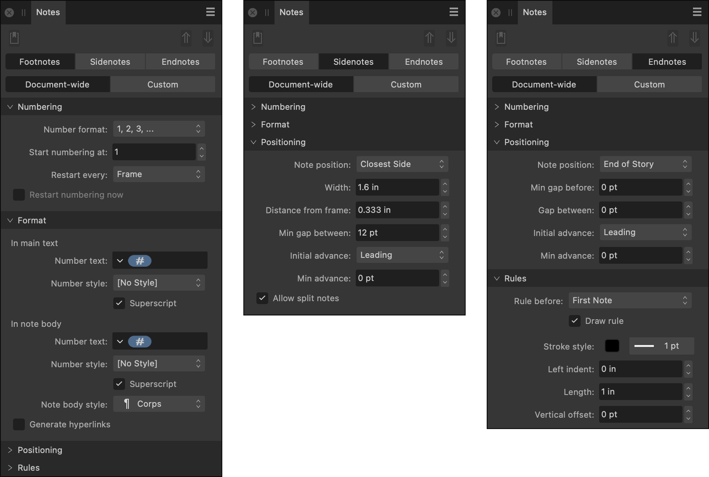

# Notes panel

The **Notes** panel allows you to insert footnotes, sidenotes and endnotes into your documents.

Each note consists of a reference at the position of insertion, and a note body, which is normally labeled with the same reference and whose position depends on the note type and your chosen settings.

## About the Notes panel

The Notes panel also allows you to customize visual attributes of references and note bodies, including the character and paragraph styles applied to them.

> **Note:** This panel is hidden by default. It can be switched on via **Window>References**.

*The Notes panel.*

### Settings

The following settings are available from the panel:

-  **Insert Note**—creates a new note of the selected type at the insertion point/end of the text selection.
-  **Go to Body**—refocuses the document view on the note body for the reference at the insertion point/within the selected text.
-  **Go to Reference**—refocuses the document view on the reference for the note body at the insertion point/in which text is selected.
- Note type—select the type of notes to be inserted or styled: **Footnotes**, **Sidenotes** or **Endnotes**
- Scope—controls the extent to which settings are applied:
  - **Document-wide**—all notes of the selected type in the current document are affected.
  - **Custom**—only the note at the insertion point/notes within the text selection or selected text frame(s) are affected.

> **Note:** If a text selection encompasses multiple note references or several endnote bodies, **Go to Body** or **Go to Reference**, respectively, uses the first one.

**Numbering**

- **Number format**—choose the letters, numbers, or symbols used for note serialization.
- **Start numbering at**—sets the starting index for note serialization. For example, for the number format **, †, ‡, …*, setting this to 1 means begin with *, 2 means begin with †, and so on.
- **Restart every**—sets whether note serialization resets to the first index after each **Frame**, **Page**, **Story**, **Section**, **Document** or **Book**.
- **Restart numbering now**—beginning with the note at the insertion point/the first note in the selection, restarts note serialization from the index specified by **Start numbering at**. (Available when **Scope** is set to *Custom*.)

> **Note:** Notes for which **Restart every** is set to **Book** are numbered as a continuous series across all of a book's chapters. For example, if such notes in the first chapter are numbered 1 to 4, then numbering of the second chapter's notes would start from 5.

**Format**

- **In main text**—the following settings control the appearance of references in story text:
  - **Number text**—sets the sequence of characters used to present note references in main (story) text.
  - **Number style**—sets the character style applied to note references in main (story) text. From this option, you can also create a new character style or edit the currently selected one.
  - **Superscript**—sets whether note references are set above the text baseline and at a reduced size.
- **In note body**—the following settings control the appearance of note bodies and their prefixed references:
  - **Number text**—sets the sequence of characters used to present note references as a prefix to note bodies.
  - **Number style**—sets the character style applied to note references where they prefix note bodies. From this option, you can also create a new character style or edit the currently selected one.
  - **Superscript**—sets whether note references are set above the text baseline and at a reduced size.
  - **Note body style**—sets the paragraph style applied to note bodies.
- **Generate hyperlinks**—when checked, the selected note type's references in story text and note bodies are hyperlinked to each other for easier cross-referencing in PDF publications.

**Positioning**

- **Note position**—sets where and how note bodies are presented. Available options depend on the selected note type:
  - For footnotes:
    - **Below Text**—anchored to the bottom of the referencing story text and spans the frame/column width.
    - **Bottom of Column**—anchored to the text frame's bottom edge, spans only the referencing column's width, and positioned inside the frame.
    - **Bottom of Frame**—anchored to the text frame's bottom edge, spans the text frame's width, and positioned inside the frame.
    - **Below Frame**—anchored to the text frame's bottom edge, spans the text frame's width, and positioned outside the frame.
  - For sidenotes:
    - **Left of Frame**—always to the left of the story text frame, regardless of being on a left or right page.
    - **Right of Frame**—always to the right of the story text frame, regardless of being on a left or a right page.
    - **Away From Spine**—in a facing-pages document, on the side of the story text frame that is furthest from the adjoining edge of the spread's pages. Otherwise, to the left of the frame.
    - **Towards Spine**—in a facing-pages document, on the side of the story text frame nearest the adjoining edge of the spread's pages. Otherwise, to the right of the frame.
    - **Alternate Sides**—on the opposite side of the story text frame from the previous sidenote in the same frame. The first sidenote body in each linked text frame is positioned:
      - away from the spine, if the document has facing pages.
      - to the story text frame's left side, if the document does not have facing pages.
    - **Closest Side**—to the side of the story text frame that is closest to the corresponding reference.
  - For endnotes:
    - **End of Story**—after the story text in the last linked text frame.
    - **Separate Frame**—in an unlinked text frame on the page after the story's last linked text frame.
    - **Shared Section Frame**—in an unlinked text frame on the section's last page.
    - **Shared Document Frame**—in an unlinked text frame on the document's last page.
    - **End of Book**—bodies are displayed and edited in an unlinked text frame in a non-printing *#Booknotes* section at the end of the document. All of a book's endnote bodies with this setting can be consolidated in a printing text frame of your choice by selecting **Endnotes>Insert Endnotes** from the **Books** panel's preferences menu.
- **Width**—the width of the area in which sidenote bodies are presented.
- **Distance from frame**—the distance between the nearest edges of story text's containing object and the area in which sidenote bodies are presented.
- **Min gap before**—the minimum distance in points between story text and the start of footnote/endnote bodies.
- **Gap between**—the distance between each note body.
- **Min gap between**—the minimum distance in points between sidenote bodies.
- **Initial advance**—sets the vertical spacing between the top of the note bodies and the first note body baseline. The distance can be the current **Leading**, a **Fixed** value, the font's **Point size** or other typographic values.
- **Min advance**—sets a minimum threshold value for initial advance. The value is global, i.e. not tied to the selected Initial Advance option.
- **Allow split notes**—when selected, footnote/sidenote bodies can begin in one text frame and continue in another. When unselected, Affinity attempts to keep each body's lines together on the same page; story text may reflow, but unwanted whitespace may occur in some text frames.
- **Pack short notes**—when unselected, each footnote body starts on a new line. When selected, consecutive footnote bodies that fit together on a single line are presented as such.
- **Short note gap**—sets the horizontal distance between packed short notes.

**Rules**

- **Rule before**—controls the type of rule affected by the section's other settings: a page's footnotes that start with a new note (**First Note**) or a split note (**Continued Note**), which begins in an earlier linked text frame.
- **Draw rule**—controls whether a rule visually separates story text and a block of footnotes of the selected rule type.
- **Stroke style**
  - **Stroke Color**—sets the rule's color.
  - **Stroke Style**—sets the rule's width and style.
- **Left indent**—sets the distance at which the rule starts relative to the text frame's left edge.
- **Length**—sets the rule's length.
- **Vertical offset**—sets the rule's relative vertical position.

**Title**

- **Title text**—when endnotes are displayed in a different frame than the story text that references them, this setting's value is displayed in the first line of their text frame.
- **Title style**—applies a paragraph style to the endnotes' title text.

## Default document settings for notes

Documents include default note settings at their time of creation. For example, endnotes automatically use the *1, 2, 3, …* number style, include hyperlinked references, and are preceded with the 'Endnotes' heading.

The Notes panel allows you to save your preferred settings for each type of note as defaults for your document, so that notes inserted in future automatically use them.

The panel also allows you to revert notes with undesirable settings to the document's defaults. This can be done for notes in a selection or throughout your whole document.

**To make the selected note's settings the default for your document:**

1. Select the note's reference in story text or a portion of its body text.
2. On the **Notes** panel, select the note's type.
3. From the Panel Preferences menu, select **Update Document Settings from Selected Footnotes**, **Update Document Settings from Selected Sidenotes** or **Update Document Settings from Selected Endnotes**.

**To revert one or more notes to your document's default note settings:**

1. On the **Notes** panel, select the note type and scope to affect.
2. Do one of the following:
  - Select a range of text that encompasses the references of only the notes you wish to revert. From the Panel Preferences menu, select **Revert Selected Footnotes to Document Settings**, **Revert Selected Sidenotes to Document Settings** or **Revert Selected Endnotes to Document Settings**.
  - From the Panel Preferences menu, select **Revert All Footnotes to Document Settings**, **Revert All Sidenotes to Document Settings** or **Revert All Endnotes to Document Settings**.

**To save a document's default note settings as app defaults:**

- From the Panel Preferences menu, select **Save Document Settings as New Defaults**.

**To reset the current document's note settings to factory defaults:**

- From the Panel Preferences menu, select **Reset Document Settings to Factory Defaults**.

## Converting notes to another note type

Existing notes of one type can be converted to another type.

The conversion process changes the styling of the note to match other notes of the target type and moves note bodies to the correct position.

**To convert all notes of one type in your document:**

1. From the **Panel Preferences** menu, select **Convert Notes**.
2. On the dialog, set the types of note you want to convert from and to.
3. Set **Scope** to **Entire Document**.
4. Click **OK**.

**To convert all notes of one type within a selection:**

1. Do one of the following:
  - To convert multiple notes, select one or more text frames, or all or part of a story's text.
  - To convert an individual note, select its reference in story text, or position the insertion point within its note body.
2. From the **Panel Preferences** menu, select **Convert Selection to Footnotes**, **Convert Selection to Sidenotes** or **Convert Selection to Endnotes**.

#### SEE ALSO:

- [About notes](../13-references/01-notes/01-about-notes.md)
- [Inserting notes](../13-references/01-notes/02-inserting-notes.md)
- [Styling notes](../13-references/01-notes/03-styling-notes.md)
- [Hyperlinking notes](../13-references/01-notes/04-hyperlinking-notes.md)
- [Customizing the workspace](../19-workspace/04-customize/02-workspace.md)
