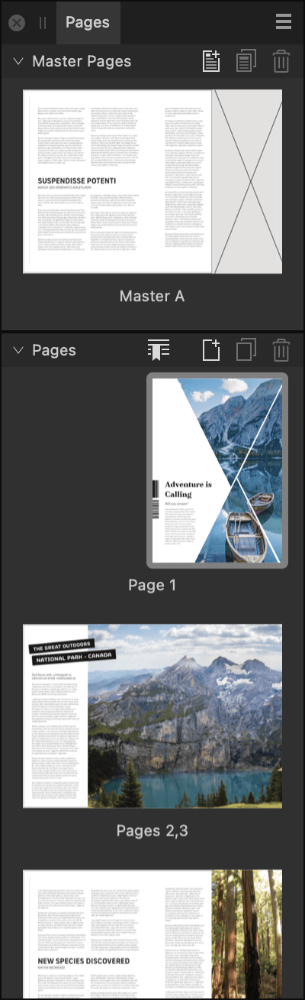

# Pages panel

The **Pages** panel allows you to easily view, add and edit master pages, publication pages, sections and spreads within your document.

## About the Pages panel

From the **Pages** panel, you can view, add, and edit pages and spreads.

Selecting one of the thumbnails from the panel allows you to view or edit that page, spread or master page.

Clicking twice on a page or spread displays the page in the window. Clicking twice on a master page name allows you to rename it.

If you double-click either the page number text below the page thumbnails or the center portion of the spread thumbnail, a zoom to fit will automatically be performed, centering the spread in the window.

*The Pages panel.*

The following panel options are available:

-  **Panel Preferences** menu containing the following options:
  - **Small**/**Medium**/**Large**/**Extra Large Thumbnails**—determines the size of the page thumbnails displayed in the panel. (Extra large scales thumbnails to almost fill the panel's width.)
  - **Scroll With View**—when selected, the **Pages** panel will scroll automatically to match the currently active viewed page in your document.
  - **Show Master Page Tags**—when selected, any color tags you've assigned to master pages are displayed as matching colored lines above the thumbnails of any pages to which the master is applied.
  - **Page Move Options**—contains options for how moving a page affects its applied master and objects:
    - **Reflow Pages**—when selected, Affinity will attempt to maintain the correct number of pages in spreads.
    - **Split Masters**—any publication page that is moved retains the page of its master for its previous position. For example, a left page that becomes a right page retains its master's left page, and vice versa.
    - **Move Master Content**—any publication page that is moved has the page of its master for its new position applied to it. Modified inherited objects and local content are moved with the page. Unmodified inherited objects are replaced with the 'correct' master page content for the destination spread.
    - **Reapply Masters**—any publication page that is moved has the page of its master for its new position applied to it. Local edits to frame content are always retained, but edited object attributes may be lost.
    - **Anchor Toward Spine**—controls the positioning of objects when their page is moved across the spine. When selected, objects maintain their distance from the spine. When unselected, objects maintain their absolute position on the page.
- **Master Pages**—this window displays the master pages that are currently available in your document. These pages contain background elements that are typically shared by multiple pages. From the **Master Pages** window, you can do the following:
  -  **Add Master**—opens the **Add Master Page** dialog, allowing you to create an additional master page.
  -  **Duplicate Selected Master**—duplicates the selected master page(s).
  -  **Delete Selected Master**—deletes the selected master page(s).
- **Pages**—this window displays publication pages and spreads within your document. From the **Pages** window, you can do the following:
  -  **Section Manager**—opens the **Section Manager** dialog, allowing you to add, delete and manage sections and adjust page numbering.
  -  **Add Pages**—allows you to create additional pages.
  -  **Duplicate Selected Pages**—allows you to duplicate selected pages.
  -  **Delete Selected Pages**—allows you to delete selected pages.

> **Tip:** When the panel's page icons are set to medium or large, they will wrap at the panel's width. You could, for example, position the panel on a secondary display and make it wider to present a flatplan-like overview of your document. When the icons are set to small, they are instead presented in a vertical list, regardless of the panel's width.

> **Note:** You can reveal more of the **Master Pages** window by dragging the darker **Pages** bar downwards.

#### SEE ALSO:

- [About pages](../05-pages-spreads-and-sections/01-about-pages-and-spreads.md)
- [About master pages](../05-pages-spreads-and-sections/12-master-pages/01-about-master-pages.md)
- [Adding sections](../05-pages-spreads-and-sections/09-adding-sections.md)
- [Customizing the workspace](../19-workspace/04-customize/02-workspace.md)
