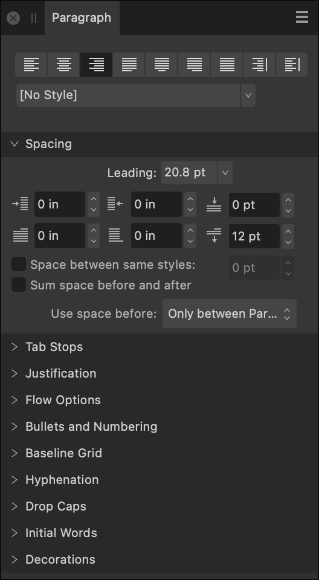

# Paragraph panel

The **Paragraph** panel allows you to control the position and flow of individual paragraphs or entire stories.

## About the Paragraph panel

The **Paragraph** panel is unique in providing the ability to:

- Control the amount of vertical space between paragraphs.
- Apply left and right indentations as well as indents for first lines only.
- Create multiple tab stops set at different distances—giving you the ability to have irregular spacing when tapping `Tab` several times.
- Adjust the behavior of justified text—giving you control over how the app calculates spacing between letters and words to allow text to be flush along both left and right margins.

*The Paragraph panel.*

The following panel options are available:

-  **Left Align**—sets the paragraph alignment to adhere to the left margin.
-  **Center Align**—sets the paragraph alignment to be equidistant from the left and right margins.
-  **Right Align**—sets the paragraph alignment to adhere to the right margin.
-  **Justified Left**—sets the paragraph alignment to both the left and right margins. The last line of a paragraph is left aligned.
-  **Justified Center**—as with Justified Left, however, the last line of a paragraph is center aligned.
-  **Justified Right**—as with Justified Left, however, the last line of a paragraph is right aligned.
-  **Justified All**—as with Justified Left, however, the last line of a paragraph is justified regardless of length (sometimes known as Force-Justified).
-  **Align Towards Spine**—aligns the paragraph dynamically towards the left or right of the spine depending on relative positioning of the text frame in relation to the spine (no justification used).
-  **Align Away From Spine**—aligns the paragraph dynamically away from the left or right of the spine depending on relative positioning of the text frame in relation to the spine (no justification used).
- Text Style—allows a paragraph [text style](../10-text/10-text-styles/01-using-text-styles.md) to be applied to selected text.

**Spacing**

- **Leading**—controls the distance between text baselines (vertical gap between lines) within the paragraph. Select from the pop-up menu. Options include:
  - **Default**—sets the line spacing to the font's default (i.e., single).
  - **Exactly**—sets a fixed spacing (other text attributes are ignored for line spacing purposes). This can be adjusted using the presets in the pop-up menu.
  - **% Height**—sets spacing based on a percentage of the text's size. This can be adjusted using the presets in the pop-up menu.
  - **At Least**—sets a minimum spacing (actual line spacing may increase depending on other text attributes). This can be adjusted using the presets in the pop-up menu.
  - **Multiple**—controls line spacing as a portion of the default. This can be adjusted using the presets in the pop-up menu.
-  **Left Indent**—controls the left indent applied to the entire paragraph (excluding the first line).
-  **Right Indent**—controls the right indent applied to the entire paragraph.
-  **Space Before Paragraph**—controls the vertical gap which precedes the paragraph. By default, this is not applied at the top of a column; this can be altered from the **Use space before:** pop-up menu.
-  **First Line Indent**—controls the indent applied to the first line of the paragraph.
-  **Last Line Outdent**—controls the outdent applied to the last line of the paragraph.
-  **Space After Paragraph**—controls the vertical gap which succeeds the paragraph.
- **Space between same styles**—when this checkbox is ticked, you can manually set the spacing between paragraphs of the same style.
- **Sum space before and after**—when this checkbox is ticked, the sum of the **Space Before Paragraph** and the **Space After Paragraph** settings are used to determine spacing between paragraphs.
- **Use space before:**—controls when **Space Before Paragraph** settings are applied to the text. Select from the pop-up menu.
- **Align to Baseline Grid**—when this checkbox is checked, paragraph text is automatically aligned to the Baseline Grid.

> **Note:** By default, the total space between two paragraphs is the larger of the **Space After** value and the **Space Before** values.

**Tab Stops**

- **Default Tab Stops**—controls the standard horizontal space added before a character when a tab (`Tab`) is inserted.
- **Add New Tab Stop**—adds an additional tab stop position.
- **Delete Selected Tab Stop**—removes the selected tab stop.
- Tab stop alignment—sets the alignment of the selected tab stop.
-     Tab stop leader—sets the characters displayed which indicates the selected tab stop.

> **Note:** See the [Paragraph formatting](../10-text/08-paragraph-level/01-paragraph-formatting.md) topic for more information.

**Justification**

-  **Minimum Word Spacing**—sets the minimum gap allowed.
-  **Desired Word Spacing**—sets the preferred gap between words.
-  **Maximum Word Spacing**—sets the maximum gap allowed.
-  **Minimum Letter Spacing**—sets the minimum tracking allowed.
-  **Desired Letter Spacing**—sets the preferred tracking (spacing between letters) within words when a paragraph has a justified alignment.
-  **Maximum Letter Spacing**—sets the maximum tracking allowed.

**Flow Options**

- **Start**—determines where a paragraph should begin. Select from the pop-up menu:
  - **Anywhere**—fits the paragraph using default settings.
  - **In Next Column**—fits the paragraph in the next column.
  - **In Next Frame**—fits the paragraph in the next frame.
  - **On Next Page**—fits the paragraph on the next page.
  - **On Next Odd Page**—fits the paragraph on the next odd page.
  - **On Next Even Page**—fits the paragraph on the next even page.
- **Keep with previous paragraph**—ensures the paragraph is kept with the previous paragraph on the page or column.
- **Prevent orphaned first lines**—ensures the first line of the paragraph is not separated from the rest of the paragraph at the bottom of a page or column.
- **Keep paragraph together**—ensures that the paragraph is not split apart.
- **Prevent widowed last lines**—ensures the last line of the paragraph is not separated from the rest of the paragraph at the top of a page or column.
- **Keep with next**—allows you to specify the number of lines of the next paragraph that must be kept with the last line of the current paragraph.

**Bullets and Numbering**

- **Type**—select a type of bullet or numbering list from the pop-up menu.
- **Level**—enter a list level.
- **Text**—allows you to adjust the symbol(s) you wish to use for your list, as well as the spacing between the symbols and the text. Click on the downward arrow or the **More** button to browse additional symbols.
- **Tab stop**—adjust the distance text moves by in your list when the tab key is pressed.
- **Alignment**—select from **Left Align Bullet/Number**, **Center Align Bullet/Number**, or **Right Align Bullet/Number**. For the latter two options, **First Line Indent** must be greater than 0.
- **Start numbering at**—for numbered lists, you can adjust the number the list starts from.
- **Restart numbering**—for numbered lists, you can restart the numbering at certain points within the list.
- **Restart numbering now**—tick this checkbox to immediately restart the numbering from the current point within your list.
- **Name**—name your list.
- **Global**—tick this checkbox to make this list available to be used multiple times within your design.
- **Style**—select a style from the pop-up menu or click **New** to create a new style using the pop-up menu.

**Hyphenation**

- **Use auto-hyphenation**—tick this checkbox to enable automatic hyphenation options to be used.
- **Minimum score**—specify the minimum possible hyphenation score. Setting this score to a higher number will result in fewer words being automatically hyphenated.
- **Minimum word length**—specify the minimum number of characters for hyphenated words.
- **Minimum prefix**—specify the minimum number of characters to be used for a prefix to be hyphenated.
- **Minimum suffix**—specify the minimum number of characters to be used for a suffix to be hyphenated.
- **Max consecutive hyphens**—specify the maximum number of consecutive hyphens.
- **Hyphenation zone**—specify the amount of space allowed before hyphenation begins.
- **Capital zone**—specify the amount of space allowed before hyphenation begins where words are in all capitals.
- **Paragraph end zone**—specify the amount of space allowed at the end of a paragraph before hyphenation begins.
- **Column end zone**—specify the amount of space allowed at the end of a column before hyphenation begins.

> **Note:** Auto-hyphenation has no effect on words that contain a soft hyphen. Putting a soft hyphen at the beginning of a word will prevent it from being hyphenated altogether.

**Drop Caps**

- **Enabled**—tick this checkbox to enable drop caps.
- **Height in lines**—specify the height of the dropped capital in lines.
- **Characters**—specify the number of characters to be formatted as drop caps.
- **Auto**—when unticked, use the Characters setting to specify how many characters are formatted as drop caps, regardless of their types. When ticked, the drop cap encompasses the first alphanumeric character and any preceding punctuation.
- **Distance to text**—specify how close the dropped capital and the rest of the text should be. This value can be negative to allow the text to be closer to the dropped capital.
- **Align left edge**—tick this checkbox to ensure the dropped capital is aligned to the left-hand edge of the column.
- **Scale for descenders**—tick this checkbox to ensure that the size of any dropped capital containing descenders is automatically adjusted so it matches the alignment of other dropped capitals.
- **Style**—select a style from the pop-up menu or click **New** to create a new style using the pop-up menu.

**Initial Words**

- **Enabled**—tick this checkbox to enable initial word formatting to be used.
- **Max word count**—specify the maximum number of words to which initial word formatting should be applied.
- **End characters**—specify which characters can be used to automatically end the initial word formatting.
- **Style**—select a style from the pop-up menu or click **New** to create a new style using the pop-up menu.

**Decorations**

- **Decoration**—select a decoration to apply to the selected paragraph. Use the plus and minus buttons to create a new decoration or delete an existing decoration.
-      **Position**—specify where you would like the decoration to appear in relation to the selected paragraph. Select from **Left**, **Top**, **Right**, **Bottom**, or **Fill** (additional options will become available in the panel when one of these is selected).
- **Indent**/**Relative to**—adjust the settings to position the decoration to your liking. A positive **Indent** position will move the decoration closer to the text, whereas a negative **Indent** position will move a decoration further away from the text.
- **Stroke**—click the color swatch to display a pop-up panel to update stroke color.
- **Stroke properties**—set the stroke style, width, joins, cap ends, order and arrowhead settings via a pop-up panel.
- **Fill**—click the color swatch to display a pop-up panel to update fill color.
- **Transparency**—click the swatch to display a pop-up panel. See the [Gradient and bitmap fills](../07-color/12-gradient-and-bitmap-fills.md) topic for more information on the settings available.
- **Combine identical**—tick this checkbox to automatically combine identical decorations.

#### SEE ALSO:

- [Paragraph formatting](../10-text/08-paragraph-level/01-paragraph-formatting.md)
- [Character panel](04-character-panel.md)
- [Customizing the workspace](../19-workspace/04-customize/02-workspace.md)
