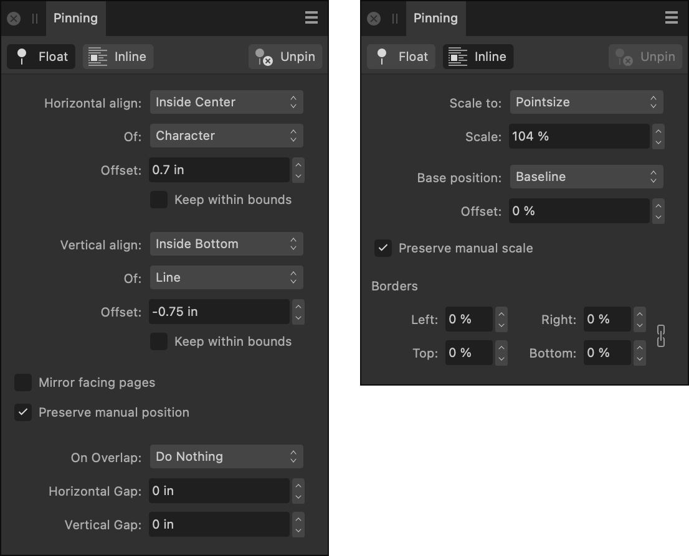

# Pinning panel

The **Pinning** panel lets you pin objects to text frames either as floating objects (anchored to the frame text) or as inline objects (inserted as a character).

## About the Pinning panel

The **Float With Text** and **Inline In Text** options on the Toolbar offer basic pinning options where the placed object is pinned to the nearest piece of text. However, the panel settings offer more options to precisely control pinned object positioning, e.g. alignment in relation to different types of page element, offsets and constrainment to within text frames.

> **Note:** This panel is hidden by default. It can be switched on via **Window>Text**.

*The Pinning panels showing Float and Inline settings.*

### Settings

The panel settings are different for floating and inline methods of pinning.

For floating objects (Float With Text), the following settings are available in the panel:

-  **Float with Text**—click to pin the selected object (e.g., image, table or text) to adjacent text in a text frame. The object will then flow with reflowing frame text. Equivalent to the **Float with Text** option on the Toolbar.
-  **Inline in Text**—click to pin the object inline (as a character) into text in your text frame. Equivalent to the **Inline in Text** option on the Toolbar.
-  **Unpin**—click to detach any floating or inline object, reverting it to a standalone object.
- **Horizontal align**—the horizontal position (e.g., Outside Left, Inside Right, etc.) in relation to the page element set in the **Of** option.
- **Of**—the page element from which horizontal alignment is made, e.g. character (pin location), frame, column, etc.
- **Offset**—offsets the object horizontally from the Horizontal align position in absolute units.
- **Keep within bounds**—ensures the pinned object can only be placed within the text frame.
- **Vertical align**—the vertical position (e.g., Inside Top, Outside Below, etc.) in relation to the page element set in the **Of** option.
- **Of**—the page element from which vertical alignment is made, e.g. character (pin location), frame, column, etc.
- **Offset**—offsets the object vertically from the Vertical align position in absolute units.
- **Keep within bounds**—stops the pinned object from being placed outside of the text frame. The object will move but only to the frame edge. When unchecked there is no restriction on object placement.
- **Mirror facing pages**—check if you're using facing pages and you want the object to automatically mirror its position in relation to text moved onto a new page.
- **Preserve manual position**—when checked, the pinned object and its pin can both be moved independently of each other. When unchecked, the pinned object is locked and will only move in accordance with the settings in the panel.
- **On Overlap**—determines whether a floating object is automatically repositioned if its regular bounds selection box overlaps that of another floating object. Select *Do Nothing* to maintain the manual position, or *Pack Horizontally* or *Stack Vertically* to position alongside or below the other object, respectively.
- **Horizontal Gap**—specifies the horizontal distance a floating object, on which **On Overlap** is set to *Pack Horizontally*, will be automatically positioned alongside another floating object that it overlaps.
- **Vertical Gap**—specifies the vertical distance a floating object, on which **On Overlap** is set to *Stack Vertically*, will be automatically positioned below another floating object that it overlaps.

For inline objects (Inline In Text), the following settings are available in the panel:

- **Scale to**—will size the inline object in relation to its point size as well as different font metrics, e.g., ascent, x-height, etc.
- **Scale**—scales the object to a percentage of the Scale to value. This keeps the same relative size if the text size changes. 100% will scale precisely to current point size if **Scale to** is set to 'Pointsize'.
- **Base position**—the inline object can be positioned vertically in relation to the baseline or descender.
- **Offset**—moves the inline object vertically in single percentage increments.
- **Preserve manual scale**—when checked, the pinned object can be scaled manually using object handles; when unchecked, the pinned object will only scale according to the panel's **Scale** option.
- **Borders**—sets a positive or negative border to the left, right, top or bottom of the inline object.

#### SEE ALSO:

- [Pinning objects](../09-object-control/15-pinning-objects.md)
- [Toolbar](../02-user-interface/02-toolbar.md)
- [Customizing the workspace](../19-workspace/04-customize/02-workspace.md)
