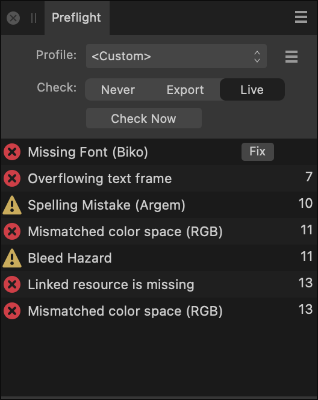

# Preflight panel

The **Preflight** panel lets you inspect the contents of a file to ensure it is ready for print or export.

## About the Preflight panel

From the **Preflight** panel, you can analyze the contents of a file to determine whether it is ready for print or export. The panel reports errors and warnings that are present in your file. From the panel, you can create preflight profiles that specify which error types you wish to check for and how extensive you would like the checking to be.

> **Note:** This panel is hidden by default. It can be switched on via the **Window** menu.

> **Note:** When a .afpub file is opened or created, preflight checking will be set to **Live** by default. When a PDF, .afdesign or .afphoto file is opened, preflight checking will be set to **Never** by default but you can adjust this manually via the panel.

*The Preflight panel.*

When a check has been made, the panel displays a list of warnings and errors it has found, allowing you to pinpoint and correct certain errors where they appear in the file. The types of warnings and errors that are listed are determined by the way the preset has been set up in the panel. Two different icons may be shown to indicate severity:

-  A yellow icon to the left of an entry is a warning of an issue that will not affect export.
-  A red icon to the left of an entry indicates an error in the file that will interrupt export.

### Settings

The following settings are available in the panel:

-  **Panel Preferences**—the menu offers :
  - **Sort by page**—when selected (default), the panel will sort errors by page number.
  - **Sort by error type**—when selected, the panel will sort errors by type.
- **Profile**—select one of the available profiles from the pop-up menu, if applicable. The word **Custom** is shown here if settings are adjusted away from the **Default** profile.
-  The following options are available from the profile's options menu:
  - **Edit profile**—clicking this option opens a dialog, allowing you to tailor preflight checking to your needs. From the dialog, you can control the severity level for preflight issues, set values and thresholds that trigger preflight warnings and errors, and control how placed documents work with preflight.
  - **Create preset**—clicking this option allows you to enter a name and specify profile options via the **Preflight Profile** dialog.
  - **Manage presets**—clicking this option opens the **Preset manager**, allowing you to manage, rename, delete, import and categorize profiles.
- **Check**—click to specify when checks should take place.
  - **Never**—preflight checking is only carried out once on document loading (background process is disabled).
  - **Export**—preflight checking is carried out on document loading and prior to print or export.
  - **Live**—preflight checking is carried out on a continual basis.
- **Check Now**—click to check your document immediately for warnings and errors. Use when **Check** is set to Never or Export.
- **Check now**—click to check your file immediately for errors.
- **Issue**—provides a description of the preflight issue.
- **Fix**—for some issues, a **Fix** button is available to directly resolve the issue in-panel.
- **Page number**—Shows the page number on which the issue occurs. **M** indicates a master page. Click the number (or M) to jump directly to the page.

#### SEE ALSO:

- [Preflight](../14-publishing-and-sharing/05-preflight.md)
- [Customizing the workspace](../19-workspace/04-customize/02-workspace.md)
