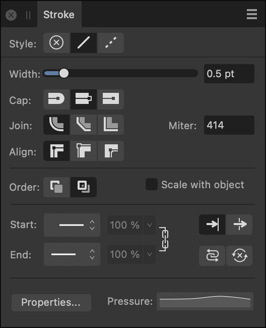
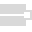
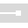
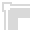
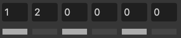

# Stroke panel

The **Stroke** panel lets you set the properties of lines and curves, as well as shape outlines.

## About the Stroke panel

Every object can take a stroke around its outline which can take on various properties, e.g. width, color, opacity, line style, etc.

*The Stroke panel showing properties applied to an object.*

The following controls are found on the panel:

-    **Style**—select a line style button to change how the line is drawn. Choose from None, Solid Line Style or Dash Line Style.
- **Width**—drag to change the width (thickness) of the selected line or enter absolute values, expressions and formulas (percentages).
-    **Cap**—select one of the cap style buttons (Round, Butt, or Square) to vary the contour of the line end.
-    **Join**—select a setting (Round, Bevel, or Miter) to determine the contour of sharp corners on the stroke. With **Miter** joins, the **Miter** setting dynamically controls if beveling occurs by extending each line at the junction by the number of line widths. If the two outer edges meet within that limit, the result is a sharp corner; if not, you’ll get a flat (Bevel) corner.
- **Miter**—sets the length of the extension of Miter joins to create either sharp or flat corners.
-    **Align**—select one of the align buttons to control where the stroke is placed in relation to the object edge, i.e. centered, or on its inside or outside.
-   **Order**—select one of the order buttons to control where the stroke is placed in relation to the object. **Draw stroke behind** hides the inner half of the object's outline behind a closed shape—useful with very small objects or when shrinking outlined text. **Draw stroke in front** always reveals the whole line.
- **Scale with Object**—check to scale both line and shape together when resizing a closed shape. Uncheck to keep line width constant.
- **Start**/**End**—select an arrowhead style for the start/end stops of the stroke from the pop-up menu.
- **Percentage**—with styles selected, you can enter a percentage to adjust the size of your selected arrowheads in proportion with the stroke width.
-   **Place arrow within the line** / **place arrow at the end of the line**—choose where to position the start and end styles at the end of the line.
-   Link—when enabled, the selected **Start** and **End** arrowheads are adjusted in proportion to each other, maintaining the current aspect ratio. When deselected, they can be adjusted independently.
-  **Swap arrowhead with tail**—select to swap the **Start** and **End** arrowhead styles.
-  **Clear arrowhead**—select to clear arrowhead settings.
- **Properties**—click to edit the brush applied from the Designer Persona's Brushes panel.
- **Pressure**—displays your current pressure profile after applying a stroke. Clicking the profile lets you edit the profile and save it for future use.
- **Dash**—when Dash Line Style is selected, the three 'Dash - Gap' pairings displayed will allow you to set the design of the dot or dash. To configure you can input values directly or drag across individual dash (white) or gap (black) strips under the number sequence. (See [Draw curves and shapes](../06-drawing-curves-and-shapes/02-draw-curves-and-shapes.md).)

  
- **Phase**—when Dash Line Style is selected, this option allows you to manually offset the starting point of the dash design if **Balanced Dash Pattern** is disabled.
-  **Balanced Dash Pattern**—when enabled, the dash pattern is applied to the shape's outline so it appears seamless along the outline and is symmetrical at all corners. When disabled, the pattern is drawn from the first drawn node of the curve or closed shape, or the geometric shape's 'start' node.

> **Note:** To change the line color, use the Color or Swatches panel.

#### SEE ALSO:

- [Draw curves and shapes](../06-drawing-curves-and-shapes/02-draw-curves-and-shapes.md)
- [Edit curves and shapes](../06-drawing-curves-and-shapes/03-edit-curves-and-shapes.md)
- [Color panel](05-color-panel.md)
- [Swatches panel](27-swatches-panel.md)
- [Expressions for field input](../26-expressions-for-field-input/01-expressions-for-field-input.md)
- [Customizing the workspace](../19-workspace/04-customize/02-workspace.md)
