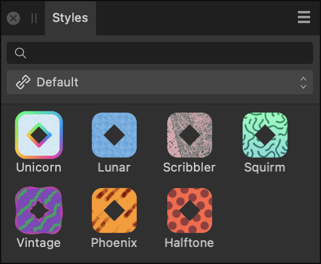

# Styles panel

The **Styles** panel lets you apply pre-designed drag-and-drop styles to your object.

> **Note:** This panel is hidden by default. It can be switched on via the **Window** menu.

## About the Styles panel

Styles are made up of effects, stroke properties, or text attributes and combinations of these. The **Styles** panel lets you apply these properties easily.

Simply a drag of an .afstyles file onto the **Styles** panel will add styles in their original category.

You can also save any object's style to the **Styles** panel for future use.

*The Styles panel showing styles in the default category.*

The panel displays the following:

- Category pop-up menu. To display style thumbnails for the chosen category.
- Style thumbnails for the current category.
- Search—allows you to filter styles in the panel to those with names which conform to the search criteria. Type directly in the text box.

## Importing and exporting styles

Styles can be exported to and imported from external files (add-ons) via the Panel Preferences menu. For more information on add-ons, see the [About add-ons](../15-add-ons/01-about-add-ons.md) topic.

### Settings

 The following options are available from the Panel Preferences menu:

- **Add New Category**—creates a new style category that you can save your custom styles into.
- **Rename Category**—renames the currently active custom category.
- **Delete Category**—deletes the currently active custom category.
- **Duplicate Category**—adds a second copy of the currently selected category to the panel. The new copy is not automatically linked to your other Affinity apps.
- **Link Category**—makes the currently selected category available in all your Affinity 2 apps.
- **[Import Styles](../15-add-ons/04-importing-add-ons.md)**—if styles have been previously exported to a file you can import them using this option.
- **[Export Styles](../15-add-ons/03-exporting-add-ons.md)**—exports the current category, and its styles, to a file.
- **Show as List**—displays the styles as a list.
- **Add Style from Selection**—if your object is selected, select this option to save the object style to the current Styles panel category.

#### SEE ALSO:

- [Styles](../09-object-control/18-styles.md)
- [Customizing the workspace](../19-workspace/04-customize/02-workspace.md)
- [About add-ons](../15-add-ons/01-about-add-ons.md)
