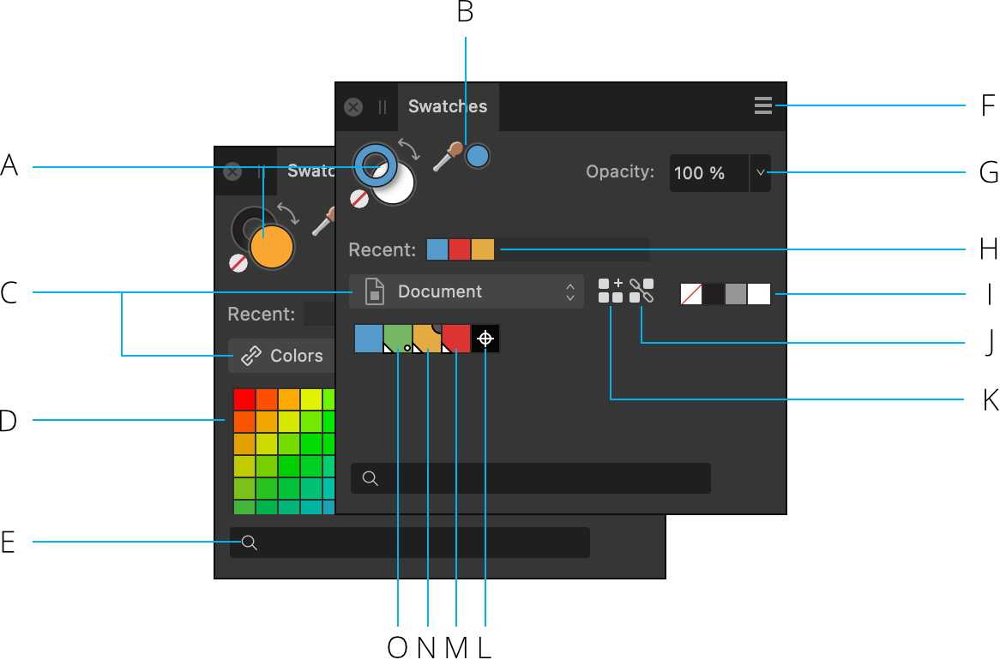
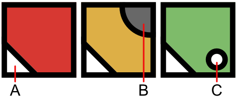

# Swatches panel

The **Swatches** panel makes it easy to use predefined colors, and also to define, store and reuse your own selection of colors.

## About the Swatches panel

**macOS:**

The **Swatches** panel stores your recently used colors and lets you access a range of predefined palettes, each containing solid or gradient fill swatches. These can be selected for use with various tools and for applying directly to objects. You can also create and store your own swatches as custom color palettes either for the document, app or system-wide, as well as import any exported Affinity .afpalette from other users or import Adobe Swatch Exchange (ASE) palettes.

**Windows:**

The **Swatches** panel stores your recently used colors and lets you access a range of predefined palettes, each containing solid or gradient fill swatches. These can be selected for use with various tools and for applying directly to objects. You can also create and store your own swatches as custom color palettes either for the document or app, as well as import any exported Affinity .afpalette from other users or import Adobe Swatch Exchange (ASE) palettes.

As well as accessing palettes, you can create global and spot colors, and make colors overprint. Your registration color can also be customized.

*Swatches panel: (A) Set Stroke/Set Fill (left) color selectors with color 'none' swatch and 'swap' arrow, (B) Color Picker and picked color swatch, (C) Category list (showing Application, left, and Document, right), (D) Category color palette swatches, (E) Search, (F) Panel Preferences, (G) Opacity control, (H) Recently used colors, (I) None, Black, Mid-gray and White swatches, (J) Add current color to palette as a global color, (K) Add current color to palette, (L) Registration color, (M) Global color, (N) Overprint color, (O) Spot color.*

*Markings which distinguish specialist color swatches: (A) Global, (B) Overprint, (C) Spot.*

Like the **Color** panel, the **Swatches** panel has different states depending on the active Persona and on the selected tool. The large color swatch selectors indicate the currently selected colors.

The **Swatches** panel also shows None, Black, Mid-gray and White swatches, recently used colors and an opacity control. Swatches are organized into color palettes by category.

> **Note:**  To add a customized registration color for professional printing, click **Panel Preferences**, then select **Add Registration Color**.

> **Note:** Preset color palettes (available from the category list pop-up menu) include**macOS:** macOS color palettes such as Apple,Web Safe Colors, System, and Crayons.
>
>  To list swatches by name instead of thumbnail, click **Panel Preferences**, then select **Appearance>Show as List**.

> **Tip:** The active swatch is whichever is shown in front of the other. You can switch between the foreground and background color selectors by pressing the **X** .

> **Note:**  The **Gradient Tool** only shows a single color selector swatch which represents the color of the currently selected stop on the gradient.

## Working with palettes

The ten most recently used colors are automatically added to the panel on a temporary basis. You can permanently store custom colors and gradients that you use most often in any of the palettes or you can create custom palettes to host them.

> **Tip:** Although you can add colors to any of the predefined palette categories, we recommend that you always create your own.

The following types of palette exist within Affinity Publisher:

- **Document**—these palettes are saved within the current document.
- **Application**—these palettes are saved within Affinity Publisher. These palettes are available to any Affinity Publisher document.
- **System**—these palettes are saved to your operating system. These palettes are available within Affinity Publisher and other applications installed on your system.
- **PANTONE®**—these palettes are based on PANTONE® Colors. These palettes are available to any Affinity Publisher document.

## Saving and deleting custom color palettes

**To create a palette:**

- Click Panel Preferences and choose an **Add Application Palette**, **Add Document Palette** or **Add System Palette**.

> **Note:** From Panel Preferences, you can also rename, delete, duplicate and link the selected palette.

**To save a color or gradient to a palette:**

1. On the **Swatches** panel, select a palette from the palette pop-up menu.
2. Do one of the following:
  - `Click`-click an object, then from the pop-up menu, click **Add to Swatches** and choose to add color from fill, stroke or both.
  - Select **Add current color to palette**, or **Add current color to palette as a global color** if you would also like to make this color a global color. Use the Stroke/Fill color selector to target the color.

**To edit a saved swatch:**

- Double-click a saved swatch.

**To delete a saved swatch:**

- `Click`-click the swatch you want to remove and choose **Delete Fill** from the pop-up menu.

## Generating a palette from document

You can generate a palette from the colors used throughout your document.

**To generate a palette from document:**

- Click Panel Preferences and choose an option from **Create Palette from Document**.

A new palette is created (named after the document) using all the colors currently in the document.

## Importing and exporting custom color palettes

Custom color palettes can be exported to and imported from external files (add-ons) via the Panel Preferences menu. For more information on add-ons, see the [About add-ons](../15-add-ons/01-about-add-ons.md) topic.

## Setting default palettes

Any palette can be set as the default used for specific color formats. For example, you can set **RGB/8** documents to have a different default palette to **CMYK/8** documents.

**To set a default palette:**

1. On the **Swatches** panel, select a palette from the palette pop-up menu.
2. Click Panel Preferences and choose a color format option from the **Set as Default for <color format>** from the pop-up menu.

To revert to using a system palette, choose **Remove Default for <color format>** from Panel Preferences.

#### SEE ALSO:

- [Selecting colors](../07-color/06-selecting-colors.md)
- [Color panel](05-color-panel.md)
- [Color chords](../07-color/11-color-chords.md)
- [Global colors](../07-color/08-global-colors.md)
- [Spot colors](../07-color/09-spot-colors.md)
- [Customizing the workspace](../19-workspace/04-customize/02-workspace.md)
- [About add-ons](../15-add-ons/01-about-add-ons.md)
- [Importing add-ons](../15-add-ons/04-importing-add-ons.md)
- [Exporting add-ons](../15-add-ons/03-exporting-add-ons.md)
