# Table panel

The **Table** panel allows you to adjust the formatting of individual tables within your document. Tables are created using the **Table Tool**.

## About the Table panel

From the **Table** panel, you can set up the formatting of your table. The Frame section refers to the color and stroke of the whole table, while the Stroke and Fill section refers to only the selected cells.

> **Note:** This panel is hidden by default. It can be switched on via **Window>Table**.

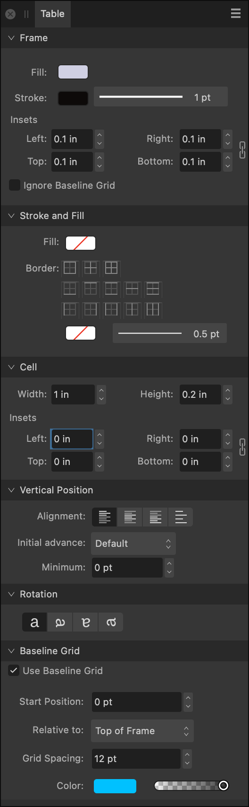
*The Table panel.*

### Options

The following panel options are available:

**Frame**

- **Fill**—sets the fill color of the entire table.
- **Stroke Color**—sets the stroke color around the entire table.
- **Stroke Properties**—sets the stroke width and stroke style around the entire table.
- **Insets**—sets white space padding between table frame and table text.
-   **Link Insets**—when enabled, the inset values are adjusted in proportion to each other. When deselected, they can be adjusted independently.
- **Ignore Baseline Grid**—check to make the table ignore any currently set document baseline grid.

**Stroke and Fill**

- **Fill**—sets the selected cell's fill color.
- 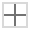   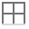 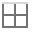 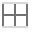 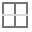 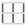 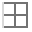 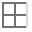 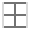 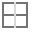 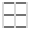 **Border**—specify which cell border(s) you would like to format within the current selection.
- **Cell Stroke Color**—sets the stroke color for the selected cell(s).
- **Cell Stroke Properties**—sets stroke width and stroke style for the selected cell(s).

**Cell**

- **Width**—adjusts the selected cell's width.
- **Height**—adjusts the selected cell's height.
- **Insets**—sets white space padding between cell edge and text within each selected table cell.
-   Link—when enabled, the inset values are adjusted in proportion to each other. When deselected, they can be adjusted independently.

**Vertical Position**

- **Top Align**—sets the cell text alignment to adhere to the top margin.
- **Center Align**—sets the cell text alignment to be equidistant from the top and bottom margins.
- **Bottom Align**—sets the cell text alignment to adhere to the bottom margin.
- **Justify**—sets the cell text alignment to both the top and bottom margins.
- **Initial Advance**—sets the vertical spacing between the top of the table cell and the first text line's baseline; the distance can be the currently set **Leading**, a **Fixed** value, the font's **Point size** or other typographic values. Use for consistent spacing on bordered tables, tables on colored backgrounds or for fine vertical alignment with other page elements.
- **Minimum**—sets a minimum threshold value for initial advance. The value is global, i.e. not tied to any specific Initial Advance setting.

**Rotation**

- **Rotate 0 degrees**—(default) leaves the selection unrotated. If a selection has previously been rotated, clicking this will revert it to an unrotated state.
- **Rotate 90 degrees**—rotates the selection 90° clockwise.
- **Rotate 180 degrees**—rotates the selection 180° clockwise.
- **Rotate 270 degrees**—rotates the selection 270° clockwise.

**Baseline Grid**

- **Use Baseline Grid**—ticking this checkbox will enable the baseline grid.
- **Start Position**—specify the offset of the first grid line from the origin at **Relative To**.
- **Relative To**—specify what the baseline grid's starting position is in relation to. The Top of Page option is used for facing page spreads arranged vertically—you can restart the grid from the top of the second page in the spread.
- **Grid Spacing**—specify how far apart consecutive horizontal grid lines are.
- **Color**—click on the swatch to display a pop-up panel to set the line color. Drag the slider to set the opacity of the line color.

#### SEE ALSO:

- [Creating tables](../11-tables/01-creating-tables.md)
- [Editing tables](../11-tables/02-editing-tables.md)
- [Table Formats panel](29-table-formats-panel.md)
- [Customizing the workspace](../19-workspace/04-customize/02-workspace.md)
