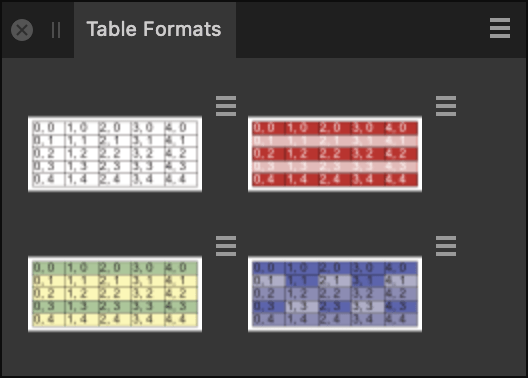

# Table Formats panel

The **Table Formats** panel creates and stores table and cell formatting options such as borders and cell colors as presets which can then be applied to other tables in your document at any time.

## About the Table Formats panel

Table and cell formatting options can be stored and managed as presets in the **Table Formats** panel. Once the formats are added to the panel, they can be applied to other tables within the document.

> **Note:** This panel is hidden by default. It can be switched on via **Window>Table**.

*The Table Formats panel displaying available tables.*

### Options

 The following options are available from Panel Preferences:

- **Save as Default**—saves the currently selected table preset as a default.
- **Import Formats**—opens a pop-up dialog allowing you to navigate to and select an existing table format to add to the panel.
- **Add Format From Selection**—with a table selected, stores the formatting of the selection as a new preset within the panel.
- **Create New Format**—adds a new table preset with default formatting settings to the panel.

 The following options are available from individual table formats' options menus:

- **Edit**—opens the **Edit Table Format** dialog, from which you can adjust the **Cell Formats**, **Name**, **Stroke and Fill**, **Border**, **Insets**, **Vertical Position**, and **Text** formatting for your table preset. You can preview the table formatting from the left-hand side of the dialog by selecting all or part of the preview table and ticking the **Apply style to selection** checkbox. The preview table can also be resized using the plus and minus icons in the corners.
- **Edit Copy**—as with **Edit**, but saves the edited table as a copy, with the original table remaining unchanged.
- **Apply**—applies the table preset's settings to a selected table.
- **Apply (Override Local)**—as with **Apply**, but uses the table preset's formatting in the place of any existing formatting that may have been applied.
- **Update From Selection**—updates the table format with settings from the currently selected table. Tables to which the table format is applied are automatically updated with the new settings.

> **Note:** Double-clicking on a table format will also open the **Edit Table Format** dialog.

#### SEE ALSO:

- [Creating tables](../11-tables/01-creating-tables.md)
- [Editing tables](../11-tables/02-editing-tables.md)
- [Table panel](28-table-panel.md)
- [Customizing the workspace](../19-workspace/04-customize/02-workspace.md)
