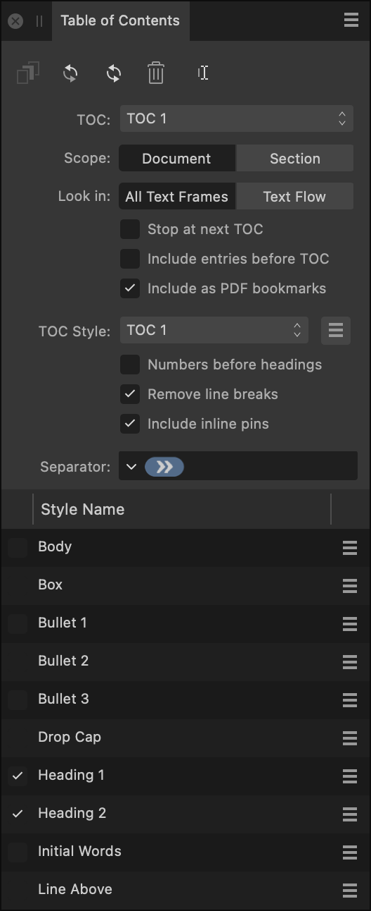

# Table of Contents panel

The **Table of Contents** panel allows you to insert, update and manage any table of contents (TOCs) within your document.

## About the Table of Contents panel

From the **Table of Contents** panel, you can insert a new table of contents, update and manage existing TOCs, and create styles for your TOCs.

> **Note:** This panel is hidden by default. It can be switched on via **Window>References**.

*The Table of Contents panel.*

The following icons are available from the top of the panel:

-  **Insert**—inserts a generated TOC in a text frame at the caret position for your document.
-  **Update**—updates the selected TOC to include TOC entries for text newly assigned with a text style that is marked to be included in the TOC.
-  **Update All Tables of Contents**—updates all TOCs within your document.
-  **Delete**—deletes the selected TOC in the TOC pop-up menu.
-  **Rename**—allows you to enter a new name for the selected TOC.

### Settings (or Preferences)

Each table of contents within the document has the following properties:

- **TOC**—select a TOC from the pop-up menu to configure its settings and jump to its page location.
- **Scope**—the TOC will be generated from all of the document or only the section containing the TOC.
- **Look In**—TOC headings will be generated from all text frames in the section(s) or only the frames that are linked in a text flow.
- **Stop at next TOC**—check to automatically stop TOC generation if another TOC is found.
- **Include entries before TOC**—check to include TOC entries before the intended TOC location, e.g., to include preface or introductory information.
- **Include as PDF Bookmarks**—when selected, allows TOC entries to be included as PDF bookmarks.

The entries that are included in a table of contents and their appearances are determined by the **TOC Style**. All tables of contents must have a **TOC Style**. These styles can be created, renamed and deleted from the **TOC Style** menu. Multiple TOCs can share a **TOC Style**.

The **TOC Style** has the following properties:

- **Numbers before headings**—check to place page numbers before the TOC headings.
- **Remove line breaks**—check to replace line breaks with a space in the TOC. For example, headings with line breaks will appear as single-line TOC entries.
- **Include inline pins**—copy inline pinned objects from headings into the TOC.
- **Separator**—specify any glyphs you would like to place between the page number and the text in an entry. Use the arrow for common glyphs.
- **Style Name**—check paragraph styles in the list to base the TOC on the text associated from those styles. For each style you select, page numbers are included by default.

The **TOC style** also holds a group of text styles, which include:

- A base paragraph style for all the entries.
- A base character style for all the page numbers in the entries.
- One paragraph style for each source style controlling how those entries will look.
- One character style for each source style controlling how page numbers for those entries will look.
- An options menu to the right of each style offering a submenu that allows you to include or exclude page numbers and specify an indent level for the style.

> **Note:** All of these styles are auto-generated, and can be edited but not deleted or renamed.

#### SEE ALSO:

- [Table of contents](../13-references/02-table-of-contents.md)
- [PDF Bookmarks](../13-references/07-pdf-bookmarks.md)
- [Customizing the workspace](../19-workspace/04-customize/02-workspace.md)
