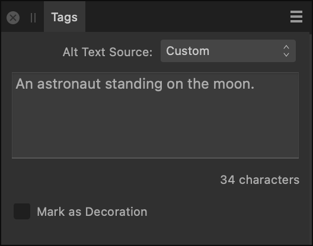

# Tags panel

The **Tags** panel allows you to add information to your document so that when it's exported to PDF, assistive technology is able to provide the reader with a better experience.

> **Note:** This panel is hidden by default. It can be switched on via the **Window** menu.

*The Tags panel.*

The following settings are available on the **Tags** panel:

- **Alt Text Source**—For a selected image, select a metadata field—*XMP:Title*, *XMP:Description*, *XMP:Headline*, *XMP:Alt Text (Accessibility)* or *XMP:Extended Description (Accessibility)*—to use as the image's alt text. For any type of selected object, select *Custom* to provide your own alt text.
- Alt Text—Type custom alt text that you wish to include in tagged PDFs.
- Character count—Displays the number of characters in the provided alt text.
- **Mark as Decoration**—Select to tag the selected object as decorative, so it will be ignored by assistive technology such as screen readers.

#### SEE ALSO:

- [Accessible PDFs](../14-publishing-and-sharing/06-pdf-publishing/03-accessible-pdfs.md)
