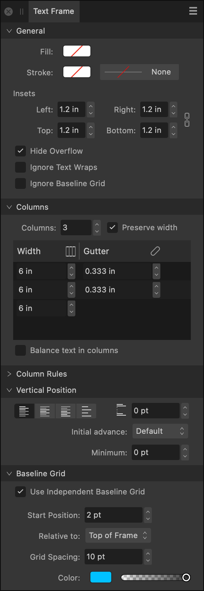

# Text Frame panel

The **Text Frame** panel lets you set up your text frame.

## About the Text Frame panel

The **Text Frame** panel provides a set of options for adjusting the frame layout, including frame stroke/fill color, number of columns, gutter settings, vertical alignment and baseline grid control.

For more information on frame text, see [Frame text](../10-text/03-frame-text.md).

> **Note:** This panel is hidden by default. It can be switched on via **Window>Text**.

*The Text Frame panel.*

### Options

The following options are available in the panel:

**General**

- **Fill**—click the color swatch to display a pop-up panel to update the text frame's fill color.
- **Frame Stroke Fill**—click the color swatch to display a pop-up panel to update the text frame's stroke color.
- **Frame Stroke**—click to display a pop-up dialog allowing you to apply a stroke width or a different stroke style to the text frame.
- **Insets**—specify the inside margins of your text frame.
-   **Link Insets**—when enabled, the inset values are adjusted in proportion to each other, maintaining the current aspect ratio. When deselected, they can be adjusted independently.
- **Hide overflow**—tick this checkbox to clip overflowing text that does not fit in the frame.
- **Ignore Text Wraps**—tick this checkbox to stop frame text from wrapping around objects with text wrapping set.
- **Ignore Baseline Grid**—tick this checkbox to make the text frame ignore any currently set document grid.

**Columns**

- **Columns**—specify the number of columns in your text frame.
- **Preserve width**—tick this checkbox to ensure that when column or gutter widths are changed, adjacent column sizes are automatically adjusted to match them. Adjusting the rightmost column will still change the frame size. This setting will be on by default.
- **Width**—specify the width of each column.
-  **Same column widths**—click to automatically make all columns the same width, calculated from the text frame width minus any inset settings.
- **Gutter**—specify the gutter size between each column.
-   **Link Gutters**—when enabled, the gutter widths are adjusted in proportion to each other. When disabled, they can be adjusted independently.
- **Balance text in columns**—tick this checkbox to automatically balance columns of text regardless of size.

**Column Rules**

- **Column Rule Stroke Fill**—click the color swatch to display a pop-up panel to update the rule stroke color.
- **Column Rule Stroke**—click to display a pop-up dialog allowing you to apply different stroke styles to the rule.
- **Gap**—specify the amount of vertical space between the Top or Bottom of the text frame and the column rule.

**Vertical Position**

- **Alignment**
  -  **Top Align**—sets the frame text alignment to adhere to the top margin.
  -  **Center Align**—sets the frame text alignment to be equidistant from the top and bottom margins.
  -  **Bottom Align**—sets the frame text alignment to adhere to the bottom margin.
  -  **Justify**—sets the frame text alignment to both the top and bottom margins.
- **Max Paragraph Space**—specifies the maximum spacing between justified baselines in the text frame. **Alignment** must be set to **Justify**.
- **Initial Advance**—Sets the vertical spacing between the top of the text frame and the first text line's baseline; the distance can be the currently set **Leading**, a **Fixed** value, the font's **Point size** or other typographic values. Use for consistent spacing on bordered text frames, text frames on colored backgrounds or for fine vertical alignment with other page elements.
- **Minimum**—sets a minimum threshold value for initial advance. The value is global, i.e. not tied to any specific Initial Advance setting.

**Baseline Grid**

- **Use Baseline Grid**—ticking this checkbox will enable baseline grids.
- **Start Position**—specify the offset of the first grid line from the origin at **Relative To**.
- **Relative To**—specify what the baseline grid's starting position is in relation to.
- **Grid Spacing**—specify how far apart consecutive horizontal grid lines are.
- **Color**—click on the swatch to display a pop-up panel to set the line color. Drag the slider to set the opacity of the line color.

#### SEE ALSO:

- [Frame text](../10-text/03-frame-text.md)
- [Decorations](../10-text/08-paragraph-level/01-paragraph-formatting/01-decorations.md)
- [Paragraph panel](18-paragraph-panel.md)
- [Character panel](04-character-panel.md)
- [Customizing the workspace](../19-workspace/04-customize/02-workspace.md)
