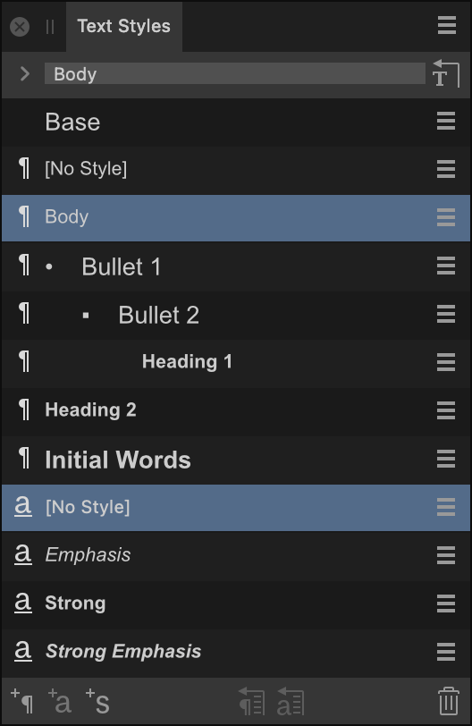

# Text Styles panel

The **Text Styles** panel gives you access to all the text styles in your document, allowing you to apply them, modify them, delete them or create new ones.

## About the Text Styles panel

The **Text Styles** panel shows you which styles are applied to the current selection and gives you the option to apply paragraph and character styles at the caret position or to selected text.

The panel also gives you options for creating new paragraph and character styles, redefining existing styles, or deleting them.

Furthermore, there are options for setting specific text styles as defaults and for importing text styles from other projects.

For more information on using text styles, see [Using text styles](../10-text/10-text-styles/01-using-text-styles.md).

*The Text Styles panel displaying default text styles.*

### Display preferences

 The following options are available from Panel Preferences:

- **Show Hierarchical**—styles appear nested below styles which they are **Based on**.
- **Show Samples**—when selected (default), a style's appearance mirrors what will be seen on the page. If this option is off, styles will all show as plain text.
- **Sort By Type**—when selected (default), paragraph styles are listed first, followed by character styles. If this option is off, styles are listed purely in alphabetical order.
- **Delete Unused Styles**—when selected, deletes any unused styles and removes them from the panel.
- **Detach and Delete All Styles**—when selected, deletes all styles and removes them from the panel.
- **Save Styles as Default**—when selected, saves styles as default styles.
- **Import Styles**—when selected, opens a pop-up dialog allowing you to select styles to import from another Publisher document.

### Options

The following options are available in the panel:

- **Current Formatting**—displays the formatting applied to the selected text or at the current caret's position. Click the arrow to the left to display overflowing information, if necessary.
-  **Reapply Text Styles**—removes local formatting from the selected text, ensuring it honors the Current Formatting perfectly.
-   Type—specifies whether the text style is a [paragraph, character or group type](../10-text/10-text-styles/04-text-style-types.md).
- Text style—displays the name of text styles currently available in the document.
- Keyboard shortcut—displays the key combination necessary to apply the text style. A shortcut must first be applied to a text style.
-  Options menu—provides access to a pop-up menu with creation and editing options.
-  **Create Paragraph Style**—launches the **Edit Text Style** dialog ready for [creating a new paragraph style](../10-text/10-text-styles/02-creating-and-managing-text-styles.md).
-  **Create Character Style**—launches the **Edit Text Style** dialog ready for [creating a new character style](../10-text/10-text-styles/02-creating-and-managing-text-styles.md).
-  **Create Group Style**—launches the **Edit Text Style** dialog ready for [creating a new group style](../10-text/10-text-styles/02-creating-and-managing-text-styles.md).
-  **Update Paragraph Style**—redefines the current paragraph style to conform with the local formatting of the selected text.
-  **Update Character Style**—redefines the current character style to conform with the local formatting of the selected text.
-  **Delete Style**—removes the selected paragraph or character style from the document and any instances of their application.

#### SEE ALSO:

- [Using text styles](../10-text/10-text-styles/01-using-text-styles.md)
- [Paragraph panel](18-paragraph-panel.md)
- [Character panel](04-character-panel.md)
- [Customizing the workspace](../19-workspace/04-customize/02-workspace.md)
