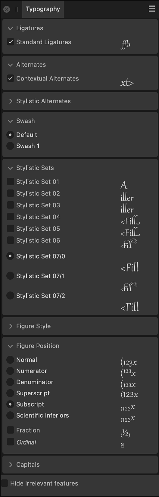

# Typography panel

The **Typography** panel allows you to customize the appearance of your text.

> **Note:** The panel is hidden by default. It can be switched on via **Window>Text>Typography**.

## About the Typography panel

The **Typography** panel in Affinity apps expands text formatting options by supporting OpenType font features, enabling a higher level of text customization. The features supported in the panel are Ligatures, Alternates, Figure Position, and Capitals.

Typography options depend on the font having the necessary glyphs to support them.

*The Typography panel.*

### Settings

The following options are available:

- Ligatures—applies any available typeface ligatures to the selected text.
- Alternates—applies any available substitutes to the selected text.
- Stylistic Alternates—applies any available font-derived substitutes for superscripts and subscripts to the selected text.
- Swash—applies any available and more ornate alternative for a glyph.
- Stylistic Sets—applies any available (and often more flamboyant) style substitutes to the selected text.
- Figure Style—applies any available font-derived styles to superscripts and subscripts to the selected text.
- Figure Position—applies any available font-derived superscripts and subscripts positioning to the selected text.
- Capitals—applies options for dealing with how capital letters are presented in the selected text.
- Hide irrelevant features—collapses panel options not relevant to the selected text.

#### SEE ALSO:

- [Character formatting](../10-text/09-character-level/01-character-formatting.md)
- [OpenType font features](../10-text/09-character-level/05-opentype-font-features.md)
- [Character panel](04-character-panel.md)
- [Paragraph panel](18-paragraph-panel.md)
