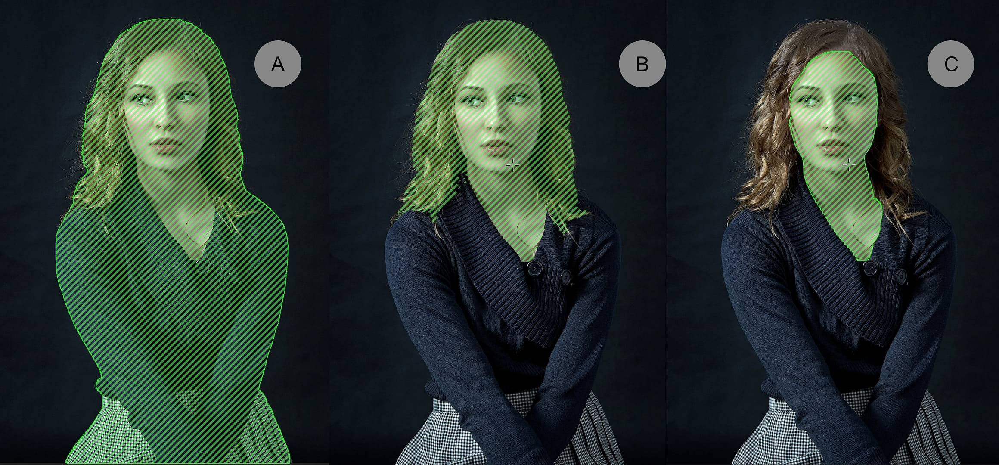
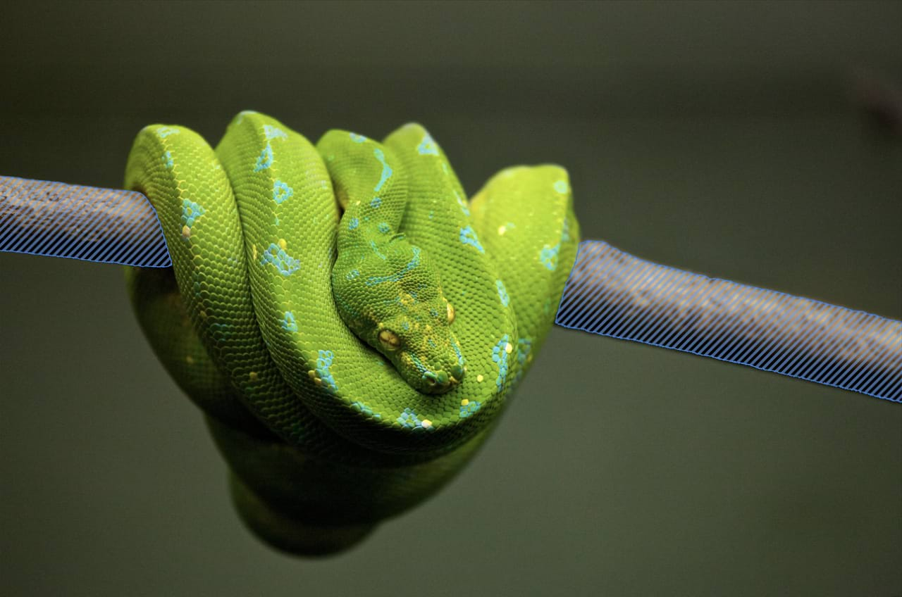

# Object Selection Tool (ML)

The Object Selection Tool allows you to easily select parts of your composition with a single click.

*The Object Selection Tool in its default operation (A), separating object components with a modifier (B), isolating components further with a modifier combo (C).*

This feature uses Machine Learning (ML) models for automatic object and subject selection. This is in line with Affinity’s ambition to use ML for the benefit of faster workflow. Models are installed as pre-trained models and do not use any of your own data for further training. Because these operations all work 'on device' none of your data leaves your device at any time.

> **Warning:** The **Segmentation** model must be downloaded prior to using the Object Selection Tool. The model is available in **Settings>Machine Learning Models** section.

## About the Object Selection Tool

The **Object Selection Tool** can be accessed it via the Tools panel. It uses a Segmentation Machine Learning model to identify objects on a layer.

Initially, while hovering over an area, the tool will indicate the inference processing by changing its icon temporarily. Once ready, the hatched lines will appear over the object to indicate what will be selected when clicked. Every newly selected area is treated as a new object selection.

> **Note:** The selection is post-processed with **Soft Edges** enabled on the context toolbar by default. For more complex elements, such as hair or fur, use **Refine** to clean up your selections.

### Settings

*Before and after Multi-part Objects option toggled on and off.*

The following settings can be adjusted from the context toolbar:

- **Mode:**
  - **New**—when enabled (default), each selection will be treated as an individual one. Pre-visualized selections are indicated by a blue hatched pattern.
  - **Add**—when enabled, each subsequent selection will be added to the previous one. Pre-visualized selections are indicated by a green hatched pattern.
  - **Subtract**—when enabled, each subsequent selection will be removed from the previous one. Pre-visualized selections are indicated by a red hatched pattern.
  - **Intersect**—when enabled, the selection will include the overlapping areas (between two or more previously selected areas). Pre-visualized selections are indicated by a blue hatched pattern.
- **Multi-part Objects**—when enabled (default), the selection will include all parts of an object (if obstructed by another object, say). When disabled, the sampling object of the mask is bounded to the area you hover over.
- **Soft Edges**—when enabled (default), the selection will be refined using a small border value to help matte and soften the selection bounds.
- **Refine**—opens a dialog with options to assist removing elements from your selections.

> **Note:** Use **Soft Edges** (above) for the majority of raster-based workflows. Consider disabling the setting for edge-focus scenarios.

> **Note — Modifier keys:** When using the tool, the following modifiers can be used:
>
> - **macOS:** Pressing the `Alt`  while clicking to confirm selections separates them into object components, which inevitably may consist of varied textures. For example, it is possible to separate a model's face from the eyes.
> - **Windows:** Pressing the `Alt`  while clicking to confirm selections separates them into object components, which inevitably may consist of varied textures. For example, it is possible to separate a model's face from the eyes.
> - **macOS:** Pressing the `Alt` + `Shift` s, further separates object components. For example, it is possible to separate parts of an outfit consisting of varied colors or textures.
> - **Windows:** Pressing the `Alt`+`Shift` s, further separates object components. For example, it is possible to separate parts of an outfit consisting of varied colors or textures.
> - Dragging on an object enables you to establish smaller selection areas, as indicated by the hatched pattern during the operation.

#### SEE ALSO:

- [Select Subject (ML)](01-selections-selectsubject.md)
- [Affinity and Machine Learning (ML)](../01-affinity-and-machine-learning-ml.md)
- Creating pixel selections
- Refining pixel selection edges
- Selection Brush Tool
- [Keyboard shortcuts for tools](../../24-keyboard-shortcuts/01-keyboard-shortcuts.md)
- [Settings](../../25-settings-preferences/01-settings-preferences.md)
