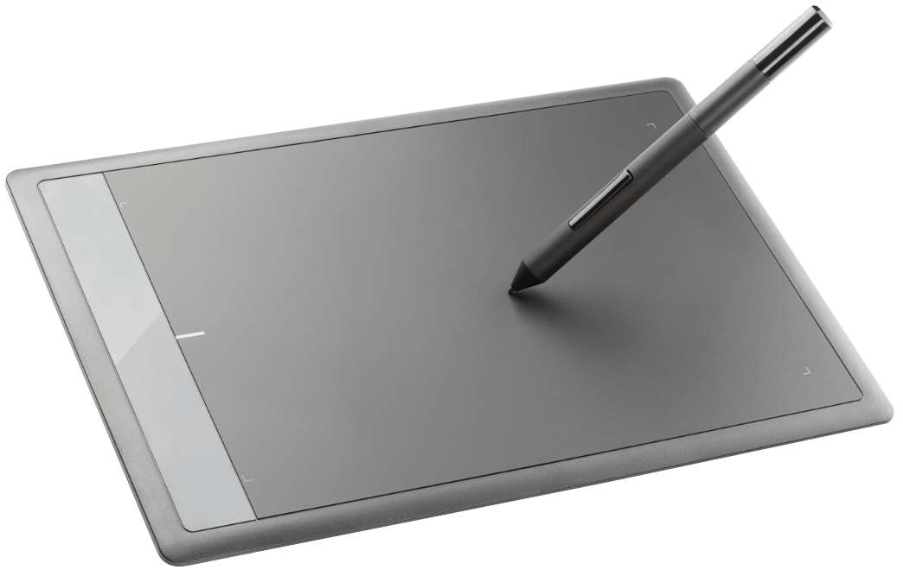

# Using pen tablets

Using a pen tablet with your Affinity apps provides a more natural drawing experience.

## Working with pen tablets

Your pen tablet is probably the most common peripheral you'll use after your mouse. Tablets enhance the design experience in Affinity products, giving a natural drawing experience using a tablet pen (pen stylus), just like a household pen.

> **Note:** Affinity does not officially support non-Wacom tablets. Please consult the original manufacturer for assistance with their tablet product.

For optimal performance, you should ensure you have the latest drivers installed for your pen tablet. To download the latest drivers, visit your tablet provider's website or use a search engine to find drivers for your tablet.

**macOS:**

Once the latest drivers are installed, it is a good idea to re-calibrate your tablet pen. This can be done from **Apple>System Settings (or Preferences)**.

**Windows:**

Once the latest drivers are installed, it is a good idea to re-calibrate your tablet pen. This can be done from the **Control Panel**.

Tablet pen capabilities may vary depending on the pen you are using. Pen rotation and stylus wheel settings are only supported on certain Wacom pens. For example:

- Barrel rotation is supported when using the Wacom Art Pen.
- The finger wheel is supported for Wacom Airbrush users.
- Switching to an eraser function and back on flipping to the side opposite the pen tip is supported in all applicable pens.

## Affinity tools and pen tablets

A number of Affinity tools and settings can be tweaked to provide perfect precision when using a pen tablet.

When drawing with a pressure-sensitive pen tablet, the **Pen Tool**'s variable width strokes will automatically match the level of pressure applied. This can be fine-tuned via the **Stroke** panel's **Properties** (for pressure sensitivity) or **Pressure** chart (for manual pressure profiling).

**Windows:**

## Tablet input preferences

To adjust the quality of your pen tablet's input when working with Affinity apps you can use one of the tablet input options.

**Windows:**

To set a preferred pen tablet input method:  From the **Edit** menu, select **Settings**. On the **Tools** tab, under **Tablet input method**, select one of the available input methods. **High Precision**—provides the best quality high-resolution input data from pen tablets that support it. This input method is not compatible with Wacom's Mouse Mode and certain makes of pen tablet. **Low Precision**—provides low-resolution input data if results from using High Precision and Windows Ink are not ideal. This is enabled by default. **Windows Ink**—provides similar quality to High Precision but is used for tablets which don't support High Precision. Windows Ink mode must be enabled in the tablet driver settings.      Most modern pen tablets can use the **High Precision** input method. If you are experiencing performance difficulties when using your tablet, changing the method to **Low Precision** may improve this.

#### SEE ALSO:

- [Settings (or Preferences)](../../25-settings-preferences/01-settings-preferences.md)
