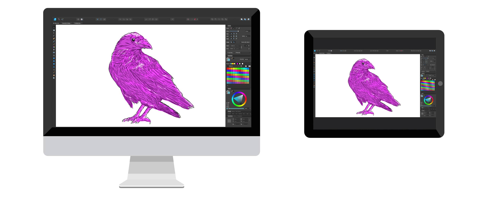
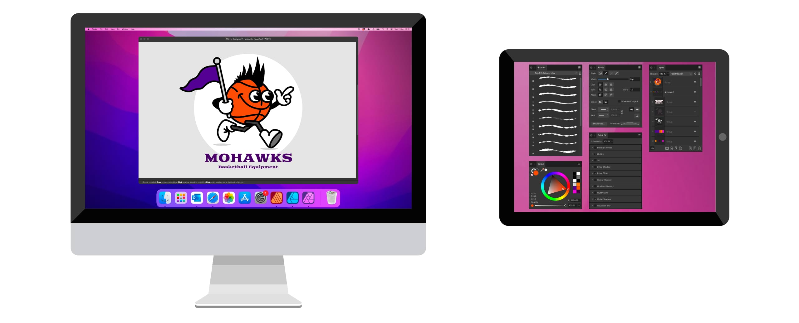

# Using Sidecar

**macOS:**

Using Sidecar Sidecar allows you to extend or mirror your Mac desktop onto your iPad’s display. With this functionality, you can draw on your iPad using an Apple Pencil to edit documents in your Affinity Mac app.   A mirrored display.    An extended display.

Sidecar works with one iPad at a time, but it can be used alongside additional external displays. Your iPad will become a secondary display by default, allowing you to arrange windows however you want between the two devices. Sidecar can display `Cmd`, `Alt`, `Ctrl` and `Shift` modifier keys and other supplementary controls on your iPad's screen, so you can perform common operations without reaching for your Mac's keyboard. For full system requirements and instructions on how to use Sidecar, see [Use an iPad as a second display for your Mac](https://support.apple.com/HT210380) at Apple Support. Sidecar and Affinity When using Sidecar, your Affinity Mac app supports pressure-sensitive input from an Apple Pencil on your iPad's screen. Your Affinity app's Studio panels can be dragged between your Mac and iPad displays as needed. The Tools Panel can be relocated between displays by selecting **View>Dock Tools** so that a checkmark is not shown next to this menu item. With Sidecar's Touch Bar feature turned on, context-sensitive controls for your Affinity app are displayed at the top or bottom of your iPad's display.

SEE ALSO:  [About workspace modes](../../19-workspace/04-customize/02-workspace.md) [Customizing the workspace](../../19-workspace/04-customize/02-workspace.md)
